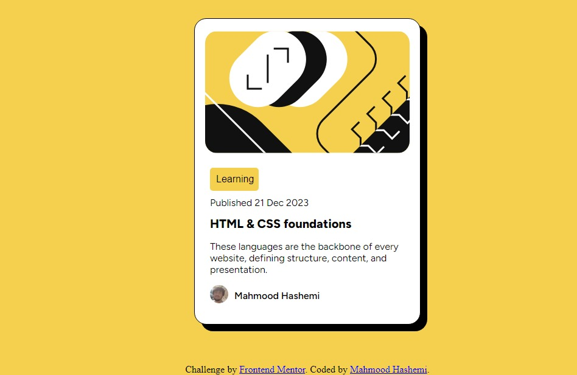

# Frontend Mentor - Blog preview card solution

## Table of contents

- [Overview](#overview)
  - [The challenge](#the-challenge)
  - [Screenshot](#screenshot)
  - [Links](#links)
- [My process](#my-process)
  - [Built with](#built-with)
  - [What I learned](#what-i-learned)
  - [Continued development](#continued-development)
- [Author](#author)

## Overview

### The challenge

Users should be able to:

- See hover and focus states for all interactive elements on the page

### Screenshot




### Links

- [Live Site URL](https://mahmoodhashem.github.io/Mentor-Challanges/Blog%20card/index.html)

## My process

### Built with

- Semantic HTML5 markup
- CSS custom properties
- Flexbox
- CSS Grid
- Mobile-first workflow

### What I learned
    I am thrilled to have had the opportunity to work with Flexbox and item alignment in this project. 


```css
.body {
   display: flex;
  justify-content: center;
  align-items: center;
  height: 100vh;
}
.card {
  display: flex;
  flex-direction: column;
  justify-content: center;
  }
```


### Continued development
    In the Future Inshallah I will work on Grid and make dynamic pages with JavaScript


## Author

- Frontend Mentor - [@MahmoodHashem](https://www.frontendmentor.io/profile/MahmoodHashem)
- Twitter - [@Mahmood18999963](https://twitter.com/Mahmood18999963)