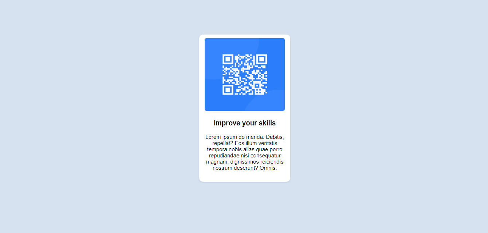

# Frontend Mentor - QR code component solution

This is a solution to the [QR code component challenge on Frontend Mentor](https://www.frontendmentor.io/challenges/qr-code-component-iux_sIO_H). Frontend Mentor challenges help you improve your coding skills by building realistic projects. 

## Table of contents

- [Overview](#overview)
  - [Screenshot](#screenshot)
  - [Links](#links)
- [My process](#my-process)
  - [Built with](#built-with)
  - [What I learned](#what-i-learned)
  - [Continued development](#continued-development)
  - [Useful resources](#useful-resources)
- [Author](#author)


## Overview

### Screenshot




### Links

- Live Site URL:[https://mahmoodhashem.github.io/Mentor-Challanges/QR%20code/index.html]

## My process

### Built with

- Semantic HTML5 markup
- CSS custom properties


### What I learned

In fact the most new things i learned were in css such as aligning, using different ways of colors and border raduis 

CSS
```css
.card {
  /* using border raduis */ 
  border-radius: 10px;
  /* using text align */ 
  text-align: center;
  /* using the rgba of colors  */ 
  box-shadow: 0 2px 4px rgba(0,0,0,0.1);
}
```


### Continued development

I think in this modul I shoud use flex or grid but I couldn't, So I want to focus on flex and grids, Inshahallah


### Useful resources

- [The Odin project](https://www.theodinproject.com/) - This helped me for All the project that i worked on. I really liked this pattern and will use it going forward.


## Author

- Frontend Mentor - [@MahmoodHashem](https://www.frontendmentor.io/profile/MahmoodHashem)
- Twitter - [@Mahmood18999963](https://twitter.com/Mahmood18999963)
