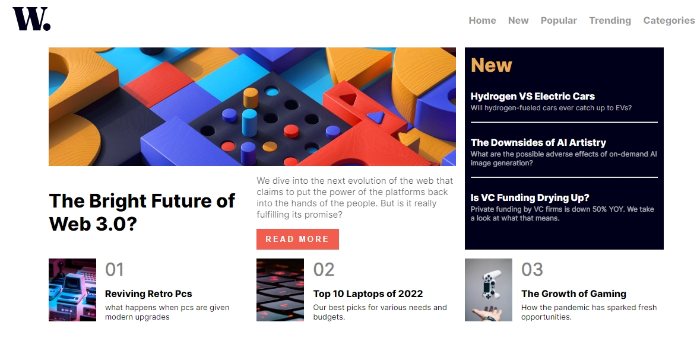

# Frontend Mentor Challenges

Welcome to my repository where I tackle challenges from [Frontend Mentor](https://www.frontendmentor.io). Frontend Mentor provides real-world coding challenges that help developers improve their coding skills by building realistic projects.

## Introduction

This repository is a collection of my solutions to various Frontend Mentor challenges. Each challenge is an opportunity to practice and refine my web development skills including HTML, CSS, JavaScript, and various frameworks and libraries.

### Repositories

<details>
    <summary>NEWBIE</summary>
    <ol>
      <li><a href="https://github.com/MahmoodHashem/Mentor-Challanges/tree/main/QR%20code">QR Code</a></li>
      <li><a href="https://github.com/MahmoodHashem/Mentor-Challanges/tree/main/Social%20links%20profile" >Social Links Profile</a></li>
      <li><a href="https://github.com/MahmoodHashem/Mentor-Challanges/tree/main/Blog%20card">Blog Card</a></li>
      <li><a href="https://github.com/MahmoodHashem/Mentor-Challanges/tree/main/nft-preveiw">NFT Preview Card</a></li>
      <li><a href="https://github.com/MahmoodHashem/Mentor-Challanges/tree/main/order-summary-component">Order Summary Component</a></li>
      <li> <a href="https://github.com/MahmoodHashem/Mentor-Challanges/tree/main/product-preview-card">Product Preview Card</a></li>
      <li><a href="https://github.com/MahmoodHashem/Mentor-Challanges/tree/main/rating-component">Rating Card Componen</a></li>
      <li><a href="https://github.com/MahmoodHashem/Mentor-Challanges/tree/main/recipe-page">Recipe Page</a></li>
      <li><a href="https://github.com/MahmoodHashem/Mentor-Challanges/tree/main/result-summary">Result Summary</a></li>
      <li><a href="https://github.com/MahmoodHashem/Mentor-Challanges/tree/main/faq-accordion">FAQ Accordion</a></li>
      <li><a href="https://github.com/MahmoodHashem/Mentor-Challanges/tree/main/3-column-preview-card">3 Column Preview Card</a></li>
      <li><a href="https://github.com/MahmoodHashem/Mentor-Challanges/tree/main/social-proof-section">Social Proof Section </a></li>
      <li><a href="https://github.com/MahmoodHashem/Mentor-Challanges/tree/main/signup-form">Intro Component with Sign-up Form</a></li>
      <li><a href="https://github.com/MahmoodHashem/Mentor-Challanges/tree/main/stats-preview-card">Stats Preview Card</a></li>
       <li><a href="https://github.com/MahmoodHashem/Mentor-Challanges/tree/main/ping-coming-soon">Ping Coming Soon</a></li>
        <li><a href="https://github.com/MahmoodHashem/Mentor-Challanges/tree/main/signle-price-grid">Single Price Grid Component</a></li>
         <li><a href="https://github.com/MahmoodHashem/Mentor-Challanges/tree/main/four-card-feature">Four Card Feature</a></li>
      <li><a href="https://github.com/MahmoodHashem/Mentor-Challanges/tree/main/huddle-landing-page">Huddle Landing Page</a></li>
    </ol>
  </details>

<details>
    <summary>JUNIOR</summary>
    <ol>
      <li><a href="https://github.com/MahmoodHashem/Mentor-Challanges/tree/main/newsletter-sign-up-with-success-message-main">Newsletter Subscription</a></li>
      <li><a href="https://github.com/MahmoodHashem/Mentor-Challanges/tree/main/age-calculator">Age Calculator</a></li>
      <li><a href="https://github.com/MahmoodHashem/Mentor-Challanges/tree/main/news-homepage-main">News Homepage</a></li>
      <li><a href="https://github.com/MahmoodHashem/Mentor-Challanges/tree/main/intro-section">Intro Section with Dropdown Menue</a></li>
      <li><a href="https://github.com/MahmoodHashem/Mentor-Challanges/tree/main/time-tracking">Time Tracking Dashboard</a></li>
      <li><a href="https://github.com/MahmoodHashem/Mentor-Challanges/tree/main/advice-generator">Advice Generator</a></li>
       <li><a href="https://github.com/MahmoodHashem/Mentor-Challanges/tree/main/huddle-landing-page-complete">Huddle Landing Page With curved</a></li>
    </ol>
  </details>

## Challenges

Below is a list of Frontend Mentor challenges I have completed.

##### QR Code Component

- [Live](https://mahmoodhashem.github.io/Mentor-Challanges/QR%20code/index.html) |[ Repo ](https://github.com/MahmoodHashem/Mentor-Challanges/tree/main/QR%20code)| [Try out](https://www.frontendmentor.io/challenges/qr-code-component-iux_sIO_H)

  - 

##### Social Links Profile

- [Live](https://mahmoodhashem.github.io/Mentor-Challanges/Social%20links%20profile/index.html) |[ Repo ](https://github.com/MahmoodHashem/Mentor-Challanges/tree/main/Social%20links%20profile)| [Try out](https://www.frontendmentor.io/challenges/social-links-profile-UG32l9m6dQ)

  - 

##### Blog Card

- [Live](https://github.com/MahmoodHashem/Mentor-Challanges/tree/main/Blog%20card) | [Repo](https://github.com/MahmoodHashem/Mentor-Challanges/tree/main/Blog%20card) | [Try out](https://www.frontendmentor.io/challenges/blog-preview-card-ckPaj01IcS)
  - 

##### NFT Preview Card

- [Live](https://mahmoodhashem.github.io/Mentor-Challanges/nft-preveiw/index.html) | [Repo](https://github.com/MahmoodHashem/Mentor-Challanges/tree/main/nft-preveiw) | [Try out](https://www.frontendmentor.io/challenges/nft-preview-card-component-SbdUL_w0U)
  - 

##### Order Summary Component

- [Live](https://mahmoodhashem.github.io/Mentor-Challanges/order-summary-component/index.html) | [Repo](https://github.com/MahmoodHashem/Mentor-Challanges/tree/main/order-summary-component) | [Try out](https://www.frontendmentor.io/challenges/order-summary-component-QlPmajDUj)
  - 

##### Product Preview Card

- [Live](https://mahmoodhashem.github.io/Mentor-Challanges/product-preview-card/index.html) | [Repo](https://github.com/MahmoodHashem/Mentor-Challanges/tree/main/product-preview-card) | [Try out](https://www.frontendmentor.io/challenges/product-preview-card-component-GO7UmttRfa)
  - 

##### Rating Component

- [Live](https://mahmoodhashem.github.io/Mentor-Challanges/rating-component/index.html) | [Repo](https://github.com/MahmoodHashem/Mentor-Challanges/tree/main/rating-component) | [Try out](https://www.frontendmentor.io/challenges/interactive-rating-component-koxpeBUmI)
  - 

##### Recipe Page

- [Live](https://mahmoodhashem.github.io/Mentor-Challanges/recipe-page/index.html) | [Repo](https://github.com/MahmoodHashem/Mentor-Challanges/tree/main/recipe-page) | [Try out](https://www.frontendmentor.io/challenges/recipe-page-KiTsR8QQKm)
  - 

##### Newsletter Subscription

- [Live](https://mahmoodhashem.github.io/Mentor-Challanges/newsletter-sign-up-with-success-message-main/newsletter-sign-up-with-success-message-main/index.html) | [Repo](https://github.com/MahmoodHashem/Mentor-Challanges/tree/main/newsletter-sign-up-with-success-message-main) | [Try out](https://www.frontendmentor.io/challenges/newsletter-signup-form-with-success-message-3FC1AZbNrv)
  - 

##### Age Calculator

- [Live](https://mahmoodhashem.github.io/Mentor-Challanges/age-calculator/index.html) | [Repo](https://github.com/MahmoodHashem/Mentor-Challanges/tree/main/age-calculator) | [Try out](https://www.frontendmentor.io/challenges/blog-preview-card-ckPaj01IcS)
  - 

##### Reuslt Summary

- [Live](https://mahmoodhashem.github.io/Mentor-Challanges/result-summary/index.html) | [Repo](https://github.com/MahmoodHashem/Mentor-Challanges/tree/main/result-summary) | [Try out](https://www.frontendmentor.io/challenges/results-summary-component-CE_K6s0maV)
  - 

##### Sign Up Form

- [Live](https://mahmoodhashem.github.io/Mentor-Challanges/signup-form/index.html) | [Repo](https://github.com/MahmoodHashem/Mentor-Challanges/tree/main/signup-form) | [Try out](https://www.frontendmentor.io/challenges/intro-component-with-signup-form-5cf91bd49edda32581d28fd1)
  - 

##### News Homepage

- [Live](https://mahmoodhashem.github.io/Mentor-Challanges/news-homepage-main/index.html) | [Repo](https://github.com/MahmoodHashem/Mentor-Challanges/tree/main/news-homepage-main) | [Try out](https://www.frontendmentor.io/challenges/news-homepage-H6SWTa1MFl)
  - 

##### Time Tracking

- [Live](https://mahmoodhashem.github.io/Mentor-Challanges/time-tracking/index.html) | [Repo](https://github.com/MahmoodHashem/Mentor-Challanges/tree/main/time-tracking) | [Try out](https://www.frontendmentor.io/challenges/time-tracking-dashboard-UIQ7167Jw)
  - 

##### Advice Generator

- [Live](https://mahmoodhashem.github.io/Mentor-Challanges/advice-generator/index.html) | [Repo](https://github.com/MahmoodHashem/Mentor-Challanges/tree/main/advice-generator) | [Try out](https://www.frontendmentor.io/challenges/advice-generator-app-QdUG-13db)
  - 

##### FAQ Accordian

- [Live](https://mahmoodhashem.github.io/Mentor-Challanges/faq-accordion/index.html) | [Repo](https://github.com/MahmoodHashem/Mentor-Challanges/tree/main/faq-accordion) | [Try out](https://www.frontendmentor.io/challenges/faq-accordion-wyfFdeBwBz)
  - 

##### Social Proof Section

- [Live](https://mahmoodhashem.github.io/Mentor-Challanges/social-proof-section/index.html) | [Repo](https://github.com/MahmoodHashem/Mentor-Challanges/tree/main/social-proof-section) | [Try out](https://www.frontendmentor.io/challenges/social-proof-section-6e0qTv_bA)
  - 

##### 3 Column Preview

- [Live](https://mahmoodhashem.github.io/Mentor-Challanges/3-column-preview-card/index.html) | [Repo](https://github.com/MahmoodHashem/Mentor-Challanges/tree/main/3-column-preview-card) | [Try out](https://www.frontendmentor.io/challenges/3column-preview-card-component-pH92eAR2-)
  - 

##### Intro Section

- [Live](https://mahmoodhashem.github.io/Mentor-Challanges/intro-section/index.html) | [Repo](https://github.com/MahmoodHashem/Mentor-Challanges/tree/main/intro-section) | [Try out](https://www.frontendmentor.io/challenges/intro-section-with-dropdown-navigation-ryaPetHE5)
  - 

##### Coding Bootcamp Testimonial Slider

- [Live](https://mahmoodhashem.github.io/Mentor-Challanges/testimonial-slider/index.html) | [Repo](https://github.com/MahmoodHashem/Mentor-Challanges/tree/main/testimonial-slider) | [Try out](https://www.frontendmentor.io/challenges/coding-bootcamp-testimonials-slider-4FNyLA8JL)
  - 

##### Ping Coming Soon

- [Live](https://mahmoodhashem.github.io/Mentor-Challanges/ping-coming-soon/index.html) | [Repo](https://github.com/MahmoodHashem/Mentor-Challanges/tree/main/ping-coming-soon) | [Try out](https://www.frontendmentor.io/challenges/ping-single-column-coming-soon-page-5cadd051fec04111f7b848da)
  - 

##### Single Price Grid Component

- [Live](https://mahmoodhashem.github.io/Mentor-Challanges/signle-price-grid/index.html) | [Repo](https://github.com/MahmoodHashem/Mentor-Challanges/tree/main/signle-price-grid) | [Try out](https://www.frontendmentor.io/challenges/single-price-grid-component-5ce41129d0ff452fec5abbbc)
  - 

##### Stats Preview Card

- [Live](https://mahmoodhashem.github.io/Mentor-Challanges/stats-preview-card/index.html) | [Repo](https://github.com/MahmoodHashem/Mentor-Challanges/tree/main/stats-preview-card) | [Try out](https://www.frontendmentor.io/challenges/stats-preview-card-component-8JqbgoU62)
  - 

##### Four Card Feature

- [Live](https://mahmoodhashem.github.io/Mentor-Challanges/four-card-feature/index.html) | [Repo](https://github.com/MahmoodHashem/Mentor-Challanges/tree/main/four-card-feature) | [Try out](https://www.frontendmentor.io/challenges/four-card-feature-section-weK1eFYK)
  - 

##### Huddle Landing Page

- [Live](https://mahmoodhashem.github.io/Mentor-Challanges/huddle-landing-page/index.html) | [Repo](https://github.com/MahmoodHashem/Mentor-Challanges/tree/main/huddle-landing-page) | [Try out](https://www.frontendmentor.io/challenges/huddle-landing-page-with-a-single-introductory-section-B_2Wvxgi0)
  - 

##### Huddle Landing Page with curved sections

- [Live](https://mahmoodhashem.github.io/Mentor-Challanges/huddle-landing-page-complete/index.html) | [Repo](https://github.com/MahmoodHashem/Mentor-Challanges/tree/main/huddle-landing-page-complete) | [Try out](https://www.frontendmentor.io/challenges/huddle-landing-page-with-curved-sections-5ca5ecd01e82137ec91a50f2)
  - 

### [All Challanges Live Site](https://mahmoodhashem.github.io/Mentor-Challanges/)

## Contributing

Feel free to fork this repository and submit pull requests to contribute to these challenges. You can also open issues to discuss potential improvements or any bugs you find.

## Contact

## If you have any questions, feel free to [contact me](mailto:shmahmoodham143@gmail.com).

_Copy this and Get my message_

```HTML
    <h1 class="info">Mahmood Hashemi <br> Mobile and Web Developer</h1>
    <div class="container"><h1 id="message">Happy Coding!</h1></div>
```

```CSS

 .info{
            position: fixed;
            color: rgb(255, 255, 255);
            font-family: sans-serif;
            letter-spacing: 5px;
            bottom: 20%;
            line-height: 2;
            opacity: 0.4;
            text-align: center;
        }

body, html {
    height: 100%;
    margin: 0;
    display: flex;
    justify-content: center;
    align-items: center;
    background-color: #282c34;
    color: #61dafb;
    font-family: Arial, sans-serif;
    background-image:
}

.container {
    text-align: center;
    animation: fadeIn 5s ease-in-out infinite;
}

@keyframes fadeIn {
    0%,100% { opacity: 0; }
    50% { opacity: 1; }
}
```

```JavaScript

document.addEventListener('DOMContentLoaded', function() {
    const message = document.getElementById('message');
    let opacity = 0;
    let direction = 1;

    setInterval(() => {
        if (opacity >= 1) direction = -1;
        else if (opacity <= 0) direction = 1;

        opacity += direction * 0.01;
        message.style.opacity = opacity;
    }, 50);
});

```
