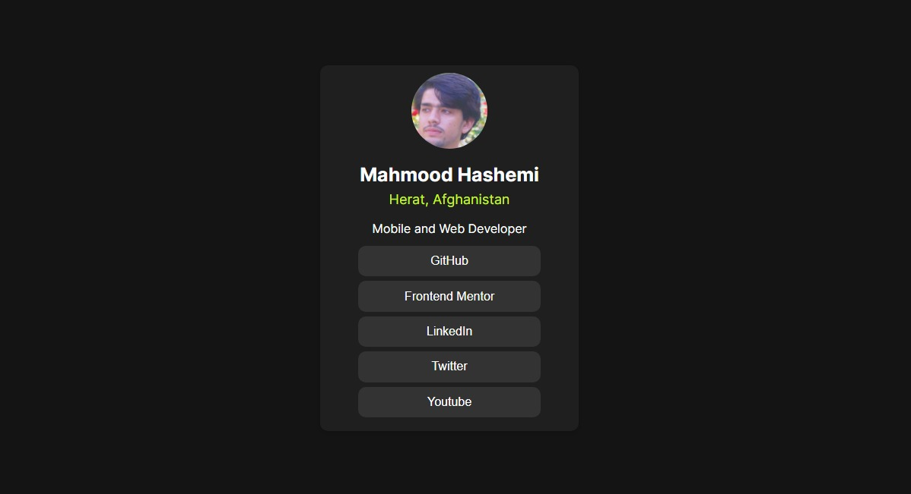

# Frontend Mentor - Social links profile solution

This is a solution to the [Social links profile challenge on Frontend Mentor](https://www.frontendmentor.io/challenges/social-links-profile-UG32l9m6dQ). Frontend Mentor challenges help you improve your coding skills by building realistic projects. 

## Table of contents

- [Overview](#overview)
  - [The challenge](#the-challenge)
  - [Screenshot](#screenshot)
  - [Links](#links)
- [My process](#my-process)
  - [Built with](#built-with)
  - [What I learned](#what-i-learned)
  - [Continued development](#continued-development)
  - [Useful resources](#useful-resources)
- [Author](#author)

## Overview

### Screenshot

### Links

- Solution URL: https://github.com/MahmoodHashem/Mentor-Challanges/tree/main/Social%20links%20profile
- Live Site URL:(https://mahmoodhashem.github.io/Mentor-Challanges/Social%20links%20profile/index.html)

## My process

### Built with

- Semantic HTML5 markup
- CSS custom properties
- Mobile-first workflow

### What I learned
I learned various methods for creating a custom button, and I also delved into CSS hover effects in a more advanced manner!

To see how you can add code snippets, see below:

## Author

- Website - [Mahmood Hashemi](https://t.me/shahmahmood)
- Frontend Mentor - [@MahmoodHashem](https://www.frontendmentor.io/profile/MahmoodHasheme/yourusername)
- Twitter - [@Mahmood18999963](https://twitter.com/Mahmood18999963)

