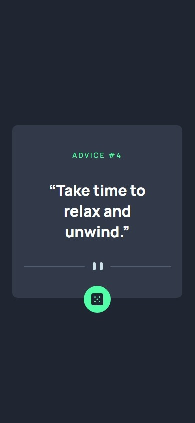

# Frontend Mentor - Advice generator app solution

This is a solution to the [Advice generator app challenge on Frontend Mentor](https://www.frontendmentor.io/challenges/advice-generator-app-QdUG-13db). Frontend Mentor challenges help you improve your coding skills by building realistic projects.

## Table of contents

- [Overview](#overview)
  - [The challenge](#the-challenge)
  - [Screenshot](#screenshot)
  - [Links](#links)
- [My process](#my-process)
  - [Built with](#built-with)
  - [What I learned](#what-i-learned)
  - [Continued development](#continued-development)
  - [Useful resources](#useful-resources)
- [Author](#author)
- [Acknowledgments](#acknowledgments)

## Overview

### The challenge

Users should be able to:

- View the optimal layout for the app depending on their device's screen size
- See hover states for all interactive elements on the page
- Generate a new piece of advice by clicking the dice icon

### Screenshot

### Links

- [Solution URL](https://github.com/MahmoodHashem/Mentor-Challanges/tree/main/advice-generator)
- [Live Site](https://mahmoodhashem.github.io/Mentor-Challanges/advice-generator/index.html)

## My process

### Built with

- Semantic HTML5 markup
- CSS custom properties
- Flexbox
- Mobile-first workflow

## Author

- Website - [Mahmood Hashemi](https://t.me/shahmahmood)
- Frontend Mentor - [@MahmoodHashem](https://www.frontendmentor.io/profile/MahmoodHasheme/yourusername)
- Twitter - [@Mahmood18999963](https://twitter.com/Mahmood18999963)

## Acknowledgments

I would like to express my gratitude to all content creators, bloggers, and senior developers who have generously made learning web development accessible and free for us. 