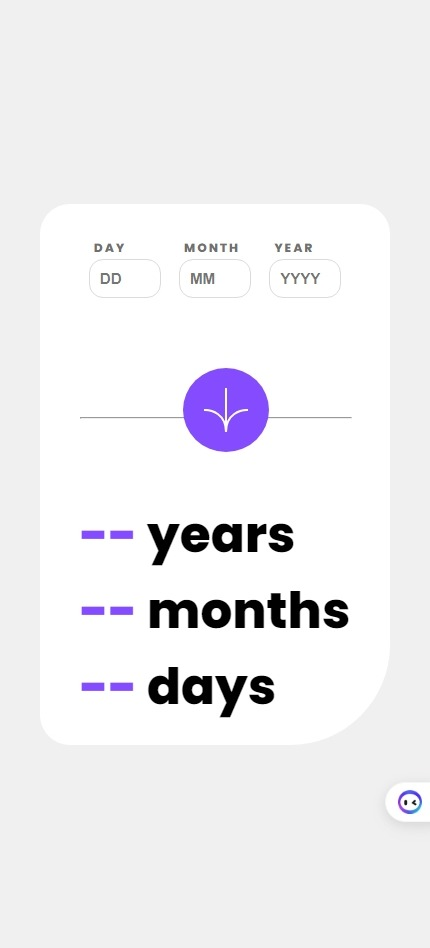

# Frontend Mentor - Age calculator app solution

This is a solution to the [Age calculator app challenge on Frontend Mentor](https://www.frontendmentor.io/challenges/age-calculator-app-dF9DFFpj-Q). Frontend Mentor challenges help you improve your coding skills by building realistic projects. 

## Table of contents

- [Overview](#overview)
  - [The challenge](#the-challenge)
  - [Screenshot](#screenshot)
  - [Links](#links)
- [My process](#my-process)
  - [Built with](#built-with)
  - [What I learned](#what-i-learned)
- [Author](#author)

**Note: Delete this note and update the table of contents based on what sections you keep.**

## Overview

### The challenge

Users should be able to:

- View an age in years, months, and days after submitting a valid date through the form
- Receive validation errors if:
  - Any field is empty when the form is submitted
  - The day number is not between 1-31
  - The month number is not between 1-12
  - The year is in the future
  - The date is invalid e.g. 31/04/1991 (there are 30 days in April)
- View the optimal layout for the interface depending on their device's screen size
- See hover and focus states for all interactive elements on the page
- **Bonus**: See the age numbers animate to their final number when the form is submitted

### Screenshot

### Links

- Solution URL: [Add solution URL here](https://github.com/MahmoodHashem/Mentor-Challanges/tree/main/age-calculator)
- Live Site URL: [Add live site URL here](https://mahmoodhashem.github.io/Mentor-Challanges/age-calculator/index.html)

## My process

### Built with

- Semantic HTML5 markup
- CSS custom properties
- Flexbox
- CSS Grid
- Mobile-first workflow
- JavaScript

### What I learned

I gained a substantial amount of knowledge from this challenge, particularly in the areas of JavaScript validation and modularity. The experience was not only challenging but also immensely beneficial. It allowed me to deepen my understanding of JavaScript and apply practical skills in a real-world scenario, enhancing both my problem-solving abilities and my coding techniques. This challenge has definitely been a significant milestone in my learning journey. 

## Author

- Website - [Mahmood Hashemi](https://t.me/shahmahmood)
- Frontend Mentor - [@MahmoodHashem](https://www.frontendmentor.io/profile/MahmoodHasheme/yourusername)
- Twitter - [@Mahmood18999963](https://twitter.com/Mahmood18999963)

