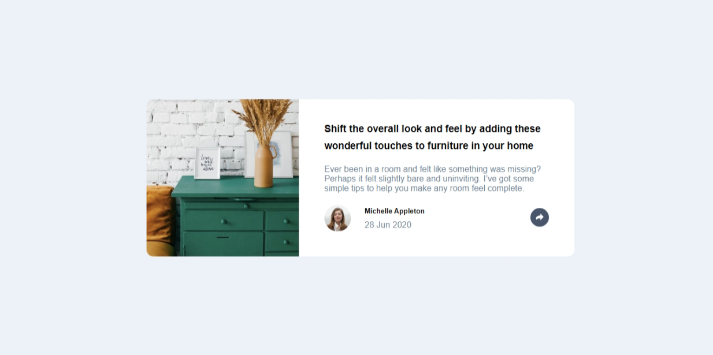

# Frontend Mentor - Article preview component solution

This is a solution to the [Article preview component challenge on Frontend Mentor](https://www.frontendmentor.io/challenges/article-preview-component-dYBN_pYFT). Frontend Mentor challenges help you improve your coding skills by building realistic projects.

## Table of contents

- [Overview](#overview)
  - [The challenge](#the-challenge)
  - [Screenshot](#screenshot)
  - [Links](#links)
- [My process](#my-process)
  - [Built with](#built-with)
  - [What I learned](#what-i-learned)
  - [Continued development](#continued-development)
  - [Useful resources](#useful-resources)
- [Author](#author)
- [Acknowledgments](#acknowledgments)

## Overview

### The challenge

Users should be able to:

- View the optimal layout for the component depending on their device's screen size
- See the social media share links when they click the share icon

### Screenshot

;

### Links

- [Solution URL](https://github.com/MahmoodHashem/Mentor-Challanges/tree/main/article-preview-component)
- [Live Site URL](https://mahmoodhashem.github.io/Mentor-Challanges/article-preview-component/index.html)

## My process

### Built with

- Semantic HTML5 markup
- CSS custom properties
- Flexbox
- Mobile-first workflow
- Vanila JavaScript

### What I learned

In this challenge, one of the key things I learned was how to leverage JavaScript to accurately detect the size of the user's screen or browser viewport. This involved exploring a few different approaches:

1. Using the `window.innerWidth` and `window.innerHeight` properties:

   - These properties provide the width and height of the browser's viewport, including any scrollbars.
2. Accessing the `screen.width` and `screen.height` properties:

   - These properties return the total width and height of the user's physical display device.
   - This can be helpful for making decisions based on the user's overall screen real estate, beyond just the browser viewport.
3. Utilizing media queries in conjunction with JavaScript:

   - Combining the power of CSS media queries with dynamic JavaScript checks.
   - This enables me to not only detect the screen size, but also apply appropriate styles and behaviors based on the user's device capabilities.

## Author

- [My Portfolio](https://main--mahmood-hashemi.netlify.app/)
- [Fronted Mentor](https://www.frontendmentor.io/profile/MahmoodHasheme/yourusername)
- [Twitter](https://twitter.com/Mahmood18999963)
- [LinkedIn](https://www.linkedin.com/in/shah-mahmood-hashemi-55172a276/)

## Acknowledgments

I would like to express my gratitude to all content creators, bloggers, and senior developers who have generously made learning web development accessible and free for us.
