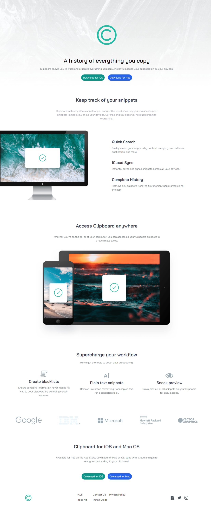
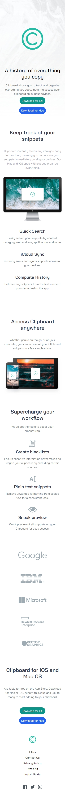

# Frontend Mentor - Clipboard landing page solution

This is my solution to the [Clipboard landing page challenge on Frontend Mentor](https://www.frontendmentor.io/challenges/clipboard-landing-page-5cc9bccd6c4c91111378ecb9). Frontend Mentor challenges help you improve your coding skills by building realistic projects.

## Table of contents

- [Overview](#overview)
  - [The challenge](#the-challenge)
  - [Screenshot](#screenshot)
  - [Links](#links)
- [My process](#my-process)
  - [Built with](#built-with)
  - [What I learned](#what-i-learned)
- [Author](#author)
- [Acknowledgments](#acknowledgments)

## Overview

### The challenge

Users should be able to:

- View the optimal layout for the site depending on their device's screen size
- See hover states for all interactive elements on the page

### Screenshot

### Links

- [Solution](https://github.com/MahmoodHashem/Mentor-Challanges/tree/main/clipboard-landing-page)
- [Live Site](https://mahmoodhashem.github.io/Mentor-Challanges/clipboard-landing-page/index.html)

## My process

### Built with

- Semantic HTML5 markup
- [Tailwind Css](https://tailwindcss.com/)

### What I learned

Through this project, I gained valuable insights into the benefits of using Tailwind, particularly its utility-first approach and mobile-first design philosophy.

* **Efficiency with Tailwind CSS** : I discovered how Tailwind's utility classes can significantly speed up the development process and enhance productivity.
* **Mobile-First Design Principles** : Understanding the importance of mobile-first design helped me create a more user-friendly interface.
* **CSS Customization** : Tailwind's customization options allowed me to easily implement design variations while maintaining consistency.

## Author

- [My Portfolio](https://main--mahmood-hashemi.netlify.app/)
- [Fronted Mentor](https://www.frontendmentor.io/profile/MahmoodHasheme/yourusername)
- [Twitter](https://twitter.com/Mahmood18999963)
- [LinkedIn](https://www.linkedin.com/in/shah-mahmood-hashemi-55172a276/)

## Acknowledgments

I would like to express my gratitude to all content creators, bloggers, and senior developers who have generously made learning web development accessible and free for us.
