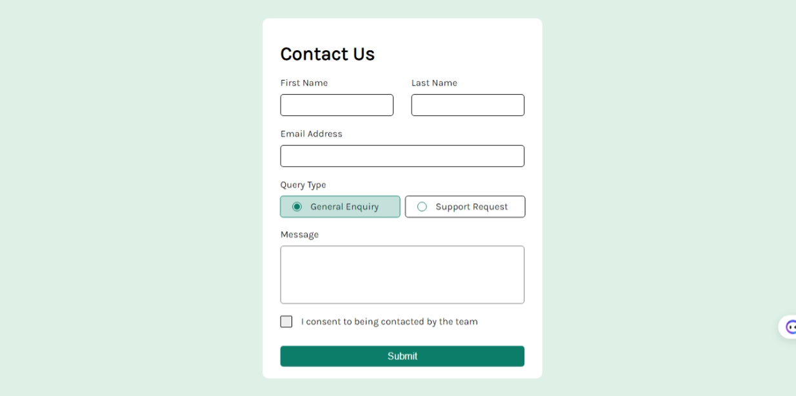
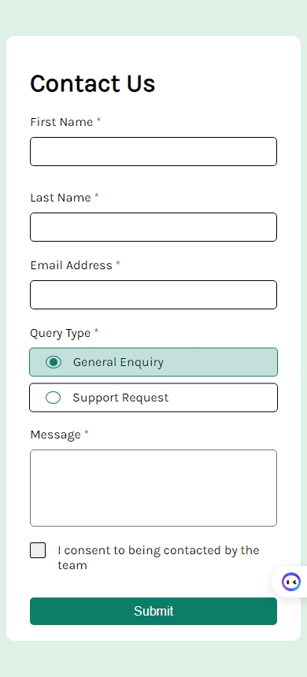

# Frontend Mentor - Contact form solution

This is a solution to the [Contact form challenge on Frontend Mentor](https://www.frontendmentor.io/challenges/contact-form--G-hYlqKJj). Frontend Mentor challenges help you improve your coding skills by building realistic projects.

## Table of contents

- [Overview](#overview)
  - [The challenge](#the-challenge)
  - [Screenshot](#screenshot)
  - [Links](#links)
- [My process](#my-process)
  - [Built with](#built-with)
  - [What I learned](#what-i-learned)
  - [Continued development](#continued-development)
  - [Useful resources](#useful-resources)
- [Author](#author)
- [Acknowledgments](#acknowledgments)

## Overview

### The challenge

Users should be able to:

- Complete the form and see a success toast message upon successful submission
- Receive form validation messages if:
  - A required field has been missed
  - The email address is not formatted correctly
- Complete the form only using their keyboard
- Have inputs, error messages, and the success message announced on their screen reader
- View the optimal layout for the interface depending on their device's screen size
- See hover and focus states for all interactive elements on the page

### Screenshot

### Links

- [Solution URL](https://github.com/MahmoodHashem/Mentor-Challanges/tree/main/contact-form)
- [Live Site URL](https://mahmoodhashem.github.io/Mentor-Challanges/contact-form/index.html)

## My process

### Built with

- Semantic HTML5 markup
- CSS custom properties
- Flexbox
- Mobile-first workflow
- Vanila JavaScript

### What I learned

In this challenge, I had the opportunity to dive deep into several important web development concepts and techniques. It was a comprehensive learning experience that has significantly expanded my skills.

1. The first key thing I learned was how to style custom radio buttons and checkboxes. Rather than relying on the default browser-provided form controls, I explored ways to create my own unique visual designs for these UI elements. This involved using CSS to hide the original controls and then rebuilding them from scratch using techniques like `pseudo-elements,` and strategic positioning. By the end of this process, I was able to craft visually appealing and consistent custom radio buttons and checkboxes that seamlessly integrated with the overall design of the project.
2. The second major area of learning was **form validation**. This challenge required me to not only understand the **HTML5 validation AP**I, but also dive into the **JavaScript validation API.** Using the HTML5 validation features, such as the `required`, `minlength `and `type` attributes, I was able to declaratively define validation rules directly in the markup. However, I also explored the programmatic validation capabilities of JavaScript, which allowed me to dynamically check form field values, trigger validation checks, display error messages, and update the UI accordingly. Mastering both the declarative and programmatic approaches to form validation has equipped me with a well-rounded skill set for handling user input reliably and effectively.

Throughout this challenge, I had to invest significant time and effort to research, experiment, and ultimately solve the various requirements. This deep dive into styling custom form elements and implementing robust form validation has been an invaluable learning experience. I now feel much more confident in my ability to create visually appealing and functionally robust web forms that provide an excellent user experience.

### Useful resources

- [Form Validation Using Javascripts Constraint Validation API](https://medium.com/stackanatomy/form-validation-using-javascripts-constraint-validation-api-fd4b7072028) - This helped me for the validation section of the challenge.

## Author

- [My Portfolio](https://main--mahmood-hashemi.netlify.app/)
- [Fronted Mentor](https://www.frontendmentor.io/profile/MahmoodHasheme/yourusername)
- [Twitter](https://twitter.com/Mahmood18999963)
- [LinkedIn](https://www.linkedin.com/in/shah-mahmood-hashemi-55172a276/)

## Acknowledgments

I would like to express my gratitude to all content creators, bloggers, and senior developers who have generously made learning web development accessible and free for us.
