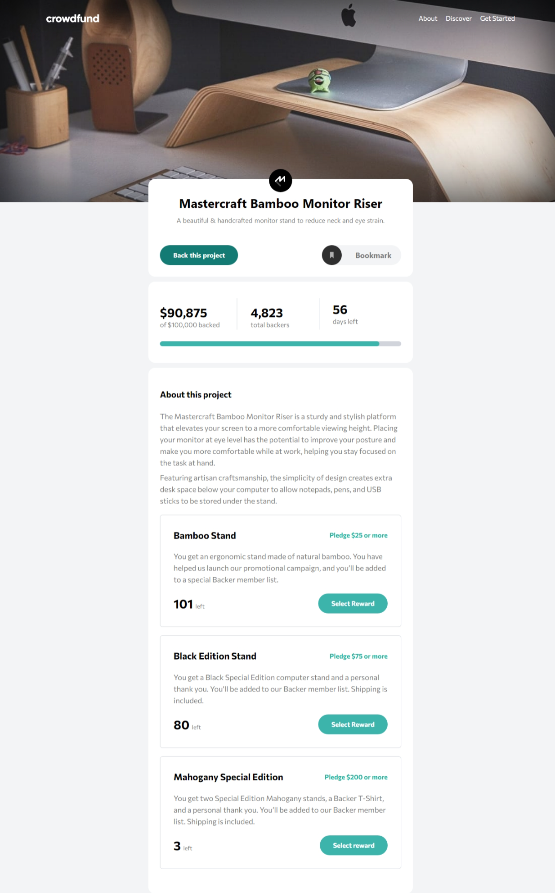

# Frontend Mentor - Crowdfunding Product Page Solution

This is my solution to the [Crowdfunding product page challenge on Frontend Mentor](https://www.frontendmentor.io/challenges/crowdfunding-product-page-7uvcZe7ZR). Frontend Mentor challenges help you improve your coding skills by building realistic projects.

## Table of contents

- [Overview](#overview)
  - [The challenge](#the-challenge)
  - [Features](#features)
  - [Screenshot](#screenshot)
  - [Links](#links)
- [My process](#my-process)
  - [Built with](#built-with)
  - [What I learned](#what-i-learned)
  - [Continued development](#continued-development)
  - [Useful resources](#useful-resources)
- [Author](#author)
- [Acknowledgments](#acknowledgments)

## Overview

### The challenge

Users should be able to:

- View the optimal layout depending on their device's screen size.
- See hover states for interactive elements.
- Make a selection of which pledge to make.
- See an updated progress bar and total money raised based on their pledge total after confirming a pledge.
- See the number of total backers increment by one after confirming a pledge.
- Toggle whether or not the product is bookmarked.

### Features

- **Responsive Design**: The layout adapts seamlessly for mobile and desktop views.
- **Interactive Modal**: Users can select pledge options in an engaging modal interface.
- **Dynamic Progress Bar**: The progress bar updates in real-time based on user pledges.
- **Pledge Count**: The total number of backers updates automatically with each pledge.
- **Bookmarking**: Users can bookmark the project for easy access later.

### Screenshot

### Links

- [Solution URL](https://github.com/MahmoodHashem/Mentor-Challanges/tree/main/crowdfunding-product-page)
- [Live site URL](https://crowd-funding-ten-zeta.vercel.app/)

## My process

### Built with

- Semantic HTML5 markup
- Mobile-first workflow
- [React](https://reactjs.org/) - JS library
- [Tailwind CSS](https://tailwindcss.com) - For styling

### What I learned

 I  gained experience in using Tailwind CSS, which allowed me to create a responsive and visually appealing design quickly. One important aspect was understanding how to ***handle dynamic classes*** and ensuring accessibility standards.

### Continued development

In future projects, I want to focus on adding animations to components to enhance user experience. Implementing smooth transitions when users interact with elements will make the application feel more polished.

### Useful resources

- [Tailwind CSS Documentation](https://tailwindcss.com/docs) - A great resource for learning how to use Tailwind effectively.

## Author

- [My Portfolio](https://your-portfolio-url.com)
- [Frontend Mentor Profile](https://www.frontendmentor.io/profile/yourusername)
- [Twitter](https://twitter.com/yourusername)
- [LinkedIn](https://www.linkedin.com/in/yourusername)

## Acknowledgments

I would like to extend my gratitude to the Frontend Mentor community for their continuous support and the resources they provide. A special thanks to all the content creators and developers whose tutorials and articles have helped me improve my skills.
