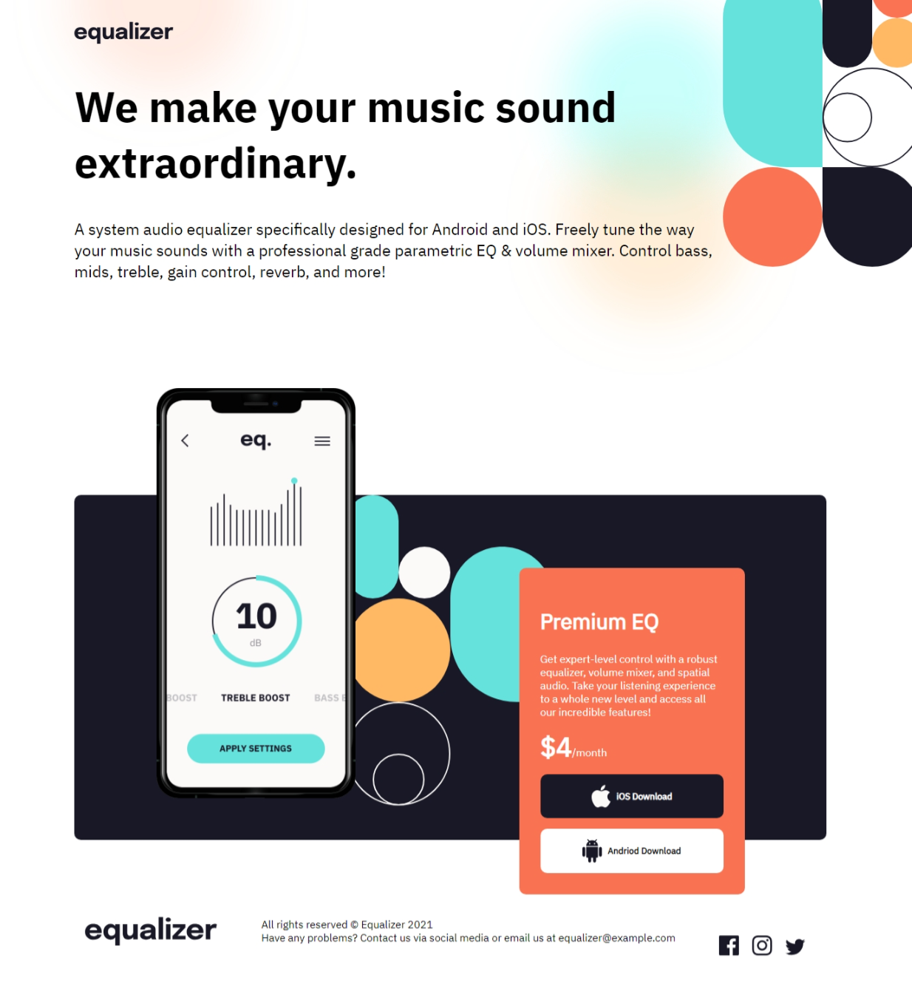

# Frontend Mentor - Crowdfunding Product Page Solution

This is my solution to the [Equalizer landing page challenge on Frontend Mentor](https://www.frontendmentor.io/challenges/crowdfunding-product-page-7uvcZe7ZR). Frontend Mentor challenges help you improve your coding skills by building realistic projects.

## Table of contents

- [Overview](#overview)
  - [The challenge](#the-challenge)
  - [Screenshot](#screenshot)
  - [Links](#links)
- [My process](#my-process)
  - [Built with](#built-with)
  - [What I learned](#what-i-learned)[Author](#author)
- [Acknowledgments](#acknowledgments)

## Overview

### The challenge

Users should be able to:

* View the optimal layout for the interface depending on their device's screen size

### Screenshot

### Links

- [Solution URL](https://github.com/MahmoodHashem/Mentor-Challanges/tree/main/equalizer-landing-page)
- [Live site URL](https://mahmoodhashem.github.io/Mentor-Challanges/equalizer-landing-page/index.html)

## My process

### Built with

- Semantic HTML5 markup
- Mobile-first workflow
- CSS
- Flexbox

### What I learned

 Difference between `:last-child` and `:last-of-type`

## Author

- [My Portfolio](https://your-portfolio-url.com)
- [Frontend Mentor Profile](https://www.frontendmentor.io/profile/yourusername)
- [Twitter](https://twitter.com/yourusername)
- [LinkedIn](https://www.linkedin.com/in/yourusername)

## Acknowledgments

I would like to extend my gratitude to the Frontend Mentor community for their continuous support and the resources they provide. A special thanks to all the content creators and developers whose tutorials and articles have helped me improve my skills.
