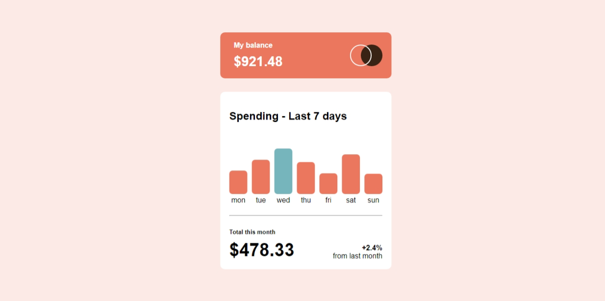

# Frontend Mentor - Expenses chart component solution

This is a solution to the [Expenses chart component challenge on Frontend Mentor](https://www.frontendmentor.io/challenges/expenses-chart-component-e7yJBUdjwt). Frontend Mentor challenges help you improve your coding skills by building realistic projects.

## Table of contents

- [Overview](#overview)
  - [The challenge](#the-challenge)
  - [Screenshot](#screenshot)
  - [Links](#links)
- [My process](#my-process)
  - [Built with](#built-with)
  - [What I learned](#what-i-learned)
- [Author](#author)
- [Acknowledgments](#acknowledgments)

## Overview

### The challenge

Users should be able to:

- View the bar chart and hover over the individual bars to see the correct amounts for each day
- See the current day’s bar highlighted in a different colour to the other bars
- View the optimal layout for the content depending on their device’s screen size
- See hover states for all interactive elements on the page
- **Bonus**: Use the JSON data file provided to dynamically size the bars on the chart

### Screenshot

  ;

### Links

- [Solution URL](https://github.com/MahmoodHashem/Mentor-Challanges/tree/main/expense-chart)
- [Live Site URL](https://mahmoodhashem.github.io/Mentor-Challanges/expense-chart/index.html)

## My process

In this challenge, one of the key things I learned was how to create dynamic charts and data visualizations using a combination of CSS and JavaScript.

On the CSS side, I likely explored techniques for building the basic chart structure, such as:

- Using `div` and `span` elements to represent the chart bars, labels, or other visual components.
- Applying styles like `width`, `height`, `background-color`, `border-radius`, etc. to shape and style the chart elements.
- Leveraging CSS positioning and layout properties to arrange the chart components properly.
- Potentially using CSS animations or transitions to add interactivity and transitions to the chart.

Then, on the JavaScript side, I was able to take this static chart structure and make it dynamic by:

- Selecting the relevant chart elements using DOM manipulation methods.
- Updating the styles of these elements programmatically, such as changing the `width` or `height` properties to reflect changing data.
- Potentially hooking into user events like clicks or hovers to trigger more advanced chart interactions.
- Using JavaScript to fetch data from source, and then updating the chart in real-time to visualize the data.

By combining the visual power of CSS and the programmatic capabilities of JavaScript, I was able to create engaging, interactive, and data-driven charts that could be tailored to the specific needs of the project.

### Built with

- Semantic HTML5 markup
- CSS custom properties
- Flexbox
- Mobile-first workflow
- Vanilla Javascript

## Author

- [My Portfolio](https://main--mahmood-hashemi.netlify.app/)
- [Fronted Mentor](https://www.frontendmentor.io/profile/MahmoodHasheme/yourusername)
- [Twitter](https://twitter.com/Mahmood18999963)
- [LinkedIn](https://www.linkedin.com/in/shah-mahmood-hashemi-55172a276/)

## Acknowledgments

I would like to express my gratitude to all content creators, bloggers, and senior developers who have generously made learning web development accessible and free for us.
