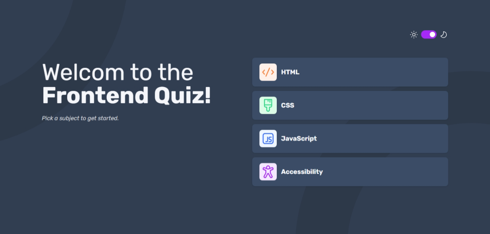
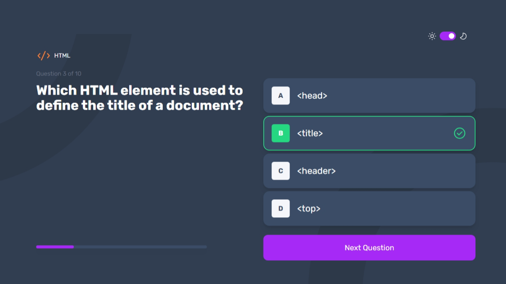
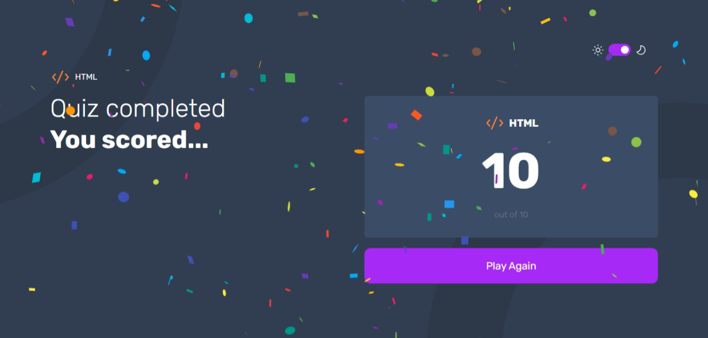

# Frontend Mentor - Frontend quiz app solution

This is My solution to the [Frontend quiz app challenge on Frontend Mentor](https://www.frontendmentor.io/challenges/frontend-quiz-app-BE7xkzXQnU). Frontend Mentor challenges help you improve your coding skills by building realistic projects.

## Table of contents

- [Overview](#overview)
- [The Challenge](#the-challenge)
- [Features](#features)
- [Links](#links)
- [My process](#my-process)
  - [Built with](#built-with)
  - [What I learned](#what-i-learned)
- [Author](#author)

## Overview

### The challenge

Users should be able to:

- Select a quiz subject
- Select a single answer from each question from a choice of four
- See an error message when trying to submit an answer without making a selection
- See if they have made a correct or incorrect choice when they submit an answer
- Move on to the next question after seeing the question result
- See a completed state with the score after the final question
- Play again to choose another subject
- View the optimal layout for the interface depending on their device's screen size
- See hover and focus states for all interactive elements on the page
- **Bonus**: Change the app's theme between light and dark

## Screenshots
 
 
 

## Links

- [GitHub Repository](https://github.com/MahmoodHashem/Mentor-Challanges/tree/main/frontend-quiz-app)
- Live Demo

## Features

- **Dynamic Quiz Selection**: Users can choose from different quizzes based on various frontend topics.
- **User-Friendly Interface**: Clean and intuitive design with responsive layouts for mobile and desktop views.
- **Instant Feedback**: Users receive immediate feedback on their answers, with visual indicators for correct and incorrect selections.
- **Score Tracking**: The app keeps track of user scores and displays the results upon quiz completion.
- **Theme Toggle**: Users can switch between light and dark themes for a personalized experience.
- **Animations**: Smooth transitions and animations enhance the user experience while navigating through questions.

## My Process

### Built With

- **React**: A JavaScript library for building user interfaces.
- **React Router**: For handling navigation and routing between different quiz pages.
- **TailwindCSS:** For styling components and creating responsive layouts.
- **JavaScript**: For adding interactivity and handling application logic.
- **Confetti**: A library used to display celebratory animations when users complete the quiz with high scores.

### What I Learned

- **Routing with React Router**: Gained hands-on experience in setting up routing within a React application.
- **Dynamic UI Updates**: Learned how to dynamically update the user interface based on user interactions and state changes.
- **CSS Animations**: Explored how to implement smooth transitions and animations to enhance user experience.
- **Theme Management**: Developed skills in managing light and dark themes with conditional rendering.
