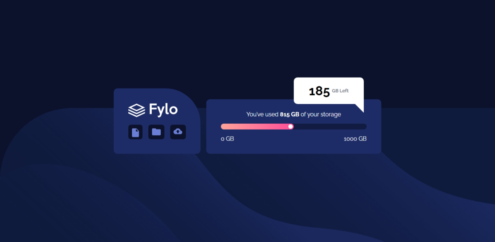

# Frontend Mentor - Fylo data storage component solution

This is my solution to the [Fylo data storage component challenge on Frontend Mentor](https://www.frontendmentor.io/challenges/fylo-data-storage-component-1dZPRbV5n). Frontend Mentor challenges help you improve your coding skills by building realistic projects.

## Table of contents

- [Overview](#overview)
  - [The challenge](#the-challenge)
  - [Screenshot](#screenshot)
  - [Links](#links)
- [My process](#my-process)
  - [Built with](#built-with)
  - [What I learned](#what-i-learned)
- [Author](#author)
- [Acknowledgments](#acknowledgments)

## Overview

### The challenge

Users should be able to:

- View the optimal layout for the site depending on their device's screen size

### Screenshot
  

### Links

- [Solution URL](https://github.com/MahmoodHashem/Mentor-Challanges/tree/main/fylo-data_storage-component)
- [Live Site URL](https://mahmoodhashem.github.io/Mentor-Challanges/fylo-data_storage-component/index.html)

## My process

### Built with

- Semantic HTML5 markup
- CSS custom properties
- Flexbox
- Mobile-first workflow

### What I learned

Creating Custome arrows:

```css
.tag::after{
  content: "";
  position: absolute;
  right: 1.5rem;
  bottom: -3rem; 
  font-size: 10px;
  border: 40px solid;
  border-left-color: transparent;
  border-top-color:transparent; 
  border-right-color: transparent;
  border-bottom-color: white;
  rotate: -90deg;
  height: 3rem;
}
```


## Author

- [My Portfolio](https://your-portfolio-url.com)
- [Frontend Mentor Profile](https://www.frontendmentor.io/profile/yourusername)
- [Twitter](https://twitter.com/yourusername)
- [LinkedIn](https://www.linkedin.com/in/yourusername)

## Acknowledgments

I would like to extend my gratitude to the Frontend Mentor community for their continuous support and the resources they provide. A special thanks to all the content creators and developers whose tutorials and articles have helped me improve my skills.
