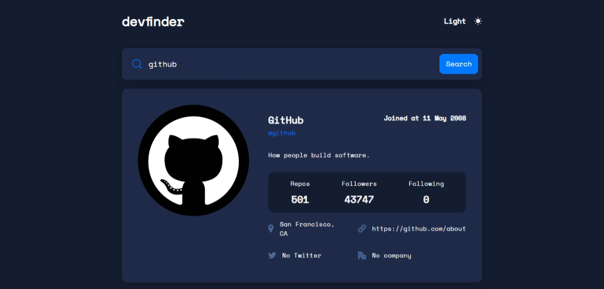

# Frontend Mentor - Github User Search

This is a solution to the [GitHub User Search challenge on Frontend Mentor](https://www.frontendmentor.io/challenges/github-user-search-api-challenge-gi9y0rA4g). Frontend Mentor challenges help you improve your coding skills by building realistic projects.

## Table of contents

- [Overview](#overview)
  - [The challenge](#the-challenge)
  - [Screenshot](#screenshot)
  - [Links](#links)
- [My process](#my-process)
  - [Built with](#built-with)
  - [What I learned](#what-i-learned)
  - [Continued development](#continued-development)
- [Author](#author)

## Overview

### The challenge

The goal of this project is to create a web application that allows users to search for GitHub profiles using usernames. The application fetches user data from the GitHub API and displays relevant information, including the user's name, bio, number of followers, and repositories. Users can also toggle between light and dark themes for better accessibility.

### Screenshot

### Links

- [Solution URL](https://github.com/MahmoodHashem/Mentor-Challanges/tree/main/github-user-search)
- [Live Site URL](https://mahmoodhashem.github.io/Mentor-Challanges/github-user-search/index.html)

## My process

### Built with

- Semantic HTML5 markup
- CSS custom properties
- Flexbox
- CSS Grid
- Mobile-first workflow
- JavaScript (for DOM manipulation and API interaction)

## Features

- **Search Functionality**: Users can enter a GitHub username to retrieve profile information.
- **Dynamic Data Fetching**: Utilizes the GitHub API to fetch user data asynchronously.
- **Responsive Design**: Adapts to various screen sizes for mobile-friendly usage.
- **Light/Dark Theme Toggle**: Users can switch themes for better visibility and comfort.
- **Error Handling**: Provides user feedback for invalid usernames or connectivity issues.
- **User-Friendly Interface**: Clean and intuitive layout designed for ease of use.

### What I learned

Throughout this project, I enhanced my skills in:
- Working with APIs and handling asynchronous operations using the Fetch API.
- Implementing responsive design principles to ensure the application works well on different screen sizes.
- Utilizing CSS variables to manage themes dynamically.
- Improving my understanding of JavaScript modules for better code organization and maintainability.

### Continued development

In future iterations of this project, I plan to:
- Add more advanced error handling for different HTTP response statuses.
- Implement user input validation for better UX.
- Create a more sophisticated theme management system that remembers user preferences.
- Enhance the UI with animations and transitions for a smoother experience.

## Author

- [My Portfolio](https://main--mahmood-hashemi.netlify.app/)
- [Frontend Mentor](https://www.frontendmentor.io/profile/MahmoodHasheme)
- [Twitter](https://twitter.com/Mahmood18999963)
- [LinkedIn](https://www.linkedin.com/in/shah-mahmood-hashemi-55172a276/)