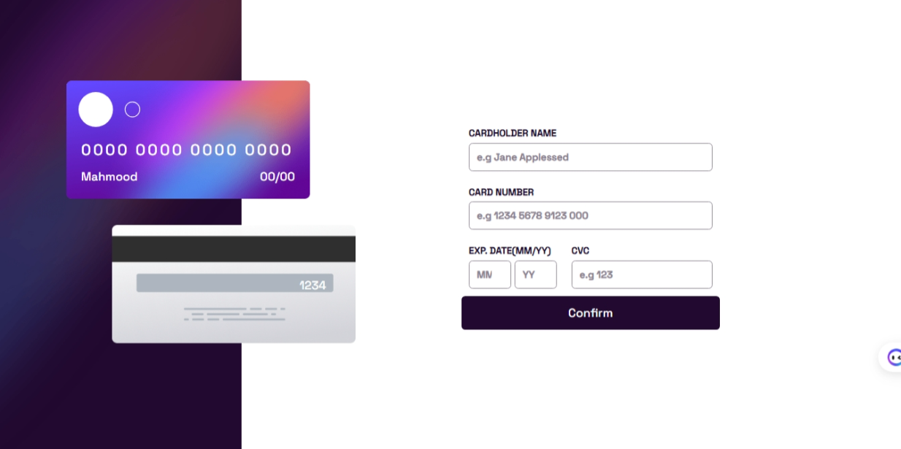

# Interactive Card Details Form

This project is a solution to the [Interactive card details form challenge on Frontend Mentor](https://www.frontendmentor.io/challenges/interactive-card-details-form-XpS8cKZDWw). The goal was to build out this interactive card details form and get it looking as close to the design as possible.

## Table of Contents
- [Overview](#overview)
  - [The Challenge](#the-challenge)
  - [Screenshot](#screenshot)
  - [Links](#links)
- [My Process](#my-process)
  - [Built With](#built-with)
  - [What I Learned](#what-i-learned)
  - [Continued Development](#continued-development)
- [Author](#author)

## Overview

### The Challenge

Users should be able to:

- Fill in the form and see the card details update in real-time
- Receive error messages when the form is submitted if:
  - Any input field is empty
  - The card number, expiry date, or CVC fields are in the wrong format
- View the optimal layout depending on their device's screen size
- See hover, active, and focus states for interactive elements on the page

### Screenshot

### Links

- Solution URL: [GitHub Repo]( https://github.com/MahmoodHashem/Mentor-Challanges/tree/main/interactive-card-details)
- Live Site URL: [Live Demo](https://mahmoodhashem.github.io/Mentor-Challanges/interactive-card-details/index.html)

## My Process

### Built With

- Semantic HTML5 markup
- CSS custom properties
- Flexbox
- JavaScript

### What I Learned

Through this project, I learned the following key things:

1. How to create a complex layout using positioning techniques
2. The most efficient way to validate a form is by using HTML and JavaScript pre-build validation API
3. The importance of writing clean, maintainable code

### Continued Development

Moving forward, I plan to focus on improving my understanding of accessibility and making sure my projects are inclusive and easy to use for all users.

## Author

- [My Portfolio](https://main--mahmood-hashemi.netlify.app/)
- [Fronted Mentor](https://www.frontendmentor.io/profile/MahmoodHasheme/yourusername)
- [Twitter](https://twitter.com/Mahmood18999963)
- [LinkedIn](https://www.linkedin.com/in/shah-mahmood-hashemi-55172a276/)

## Acknowledgments

I would like to express my gratitude to all content creators, bloggers, and senior developers who have generously made learning web development accessible and free for us.
