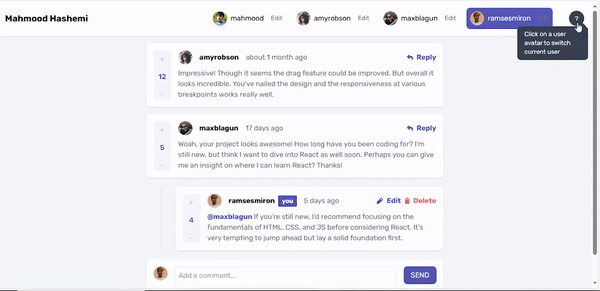

# Frontend Mentor - Interactive comments section solution

This is my solution to the [Interactive comments section challenge on Frontend Mentor](https://www.frontendmentor.io/challenges/interactive-comments-section-iG1RugEG9). Frontend Mentor challenges help you improve your coding skills by building realistic projects.

## Table of contents

- [Overview](#overview)
  - [The challenge](#the-challenge)
  - [Screenshot](#screenshot)
  - [Links](#links)
  - [Features](#features)
- [My process](#my-process)
  - [Built with](#built-with)
  - [What I learned](#what-i-learned)
  - [Continued development](#continued-development)
- [Author](#author)
- [Acknowledgments](#acknowledgments)

## Overview

### The challenge

Users should be able to:

- View the optimal layout for the app depending on their device's screen size
- See hover states for all interactive elements on the page
- Create, Read, Update, and Delete comments and replies
- Upvote and downvote comments
- **Bonus**: If you're building a purely front-end project, use `localStorage` to save the current state in the browser that persists when the browser is refreshed.
- **Bonus**: Instead of using the `createdAt` strings from the `data.json` file, try using timestamps and dynamically track the time since the comment or reply was posted.

### Screenshots

### Features

- Add/Edit/Delete comments
- Dynamic comment management system
- User profile customization with image uploads
- Single-level reply threading like YouTube
- Voting system with vote tracking
- Real-time timestamp updates using date-fns
- Confirmation modals for destructive actions
- Responsive design with Tailwind CSS
- Interactive tooltips for better UX

## My process

### Built with

- **React.js:** for UI components
- **Tailwind CSS** for styling
- **date-fns** for timestamp handling
- Modern JavaScript ES6+ features
- Mobile-first workflow
- Semantic HTML5 markup

### What I learned

I came across a video of **[Kevil Powel](https://youtu.be/WoWxxj3pzrE?si=T3s-j7gMy3aZLeJ9)** from Youtube where He said that Frontend menotor will not help so much unless you add some extra features to your project. So I added some extra features like  switching users. I also added a feature where you can change the user name and image.

OverAll I learned these:

- Advanced React state management
- Complex component composition
- Dynamic user interaction handling
- Real-time data updates
- Modern CSS techniques with Tailwind
- Timestamp formatting and tracking
- Image upload and preview handling

### Continued development

- Implement data persistence with localStorage
- Add user authentication
- Enhance accessibility features
- Add comment sorting options
- Implement comment search functionality

## Author

- Website - [Mahmood Hashemi](https://main--mahmood-hashemi.netlify.app/)
- Frontend Mentor - [@MahmoodHashemi](https://www.frontendmentor.io/profile/MahmoodHashemi)
- Twitter - [@Mahmood18999963](https://twitter.com/Mahmood18999963)
- LinkedIn - [Shah Mahmood Hashemi](https://www.linkedin.com/in/shah-mahmood-hashemi-55172a276/)

## Acknowledgments

Special thanks to Frontend Mentor for providing this challenging project that helped enhance my React and modern web development skills.
