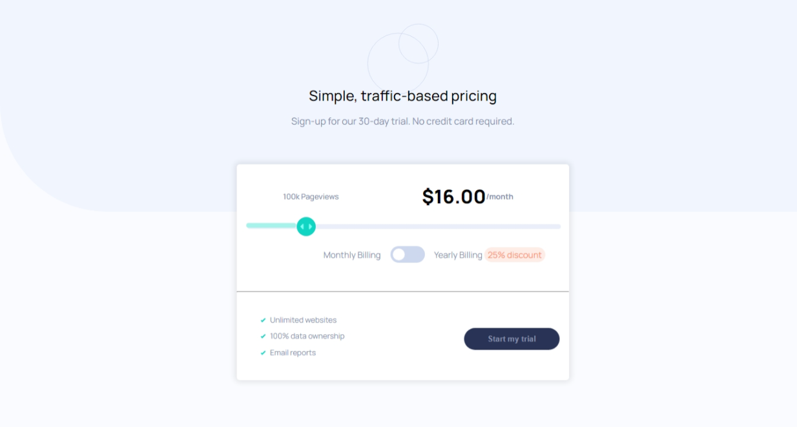
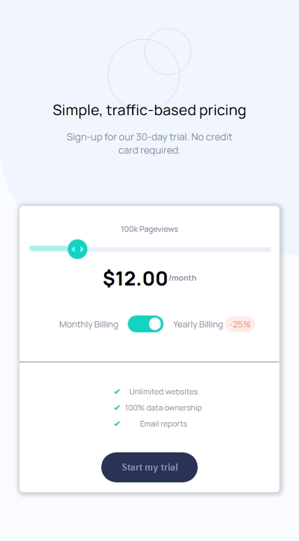

# Frontend Mentor - Interactive pricing component solution

This is a solution to the [Interactive pricing component challenge on Frontend Mentor](https://www.frontendmentor.io/challenges/interactive-pricing-component-t0m8PIyY8). Frontend Mentor challenges help you improve your coding skills by building realistic projects.

## Table of contents

- [Overview](#overview)
  - [The challenge](#the-challenge)
  - [Screenshot](#screenshot)
  - [Links](#links)
- [My process](#my-process)
  - [Built with](#built-with)
  - [What I learned](#what-i-learned)
  - [Useful resources](#useful-resources)
- [Author](#author)
- [Acknowledgments](#acknowledgments)

## Overview

### The challenge

Users should be able to:

- View the optimal layout for the app depending on their device's screen size
- See hover states for all interactive elements on the page
- Use the slider and toggle to see prices for different page view numbers

### Screenshot




### Links

- [Solution URL](https://github.com/MahmoodHashem/Mentor-Challanges/tree/main/interactive-pricing-component)
- [Live Site URL](https://mahmoodhashem.github.io/Mentor-Challanges/interactive-pricing-component/index.html)

## My process

### Built with

- Semantic HTML5 markup
- CSS custom properties
- Flexbox
- CSS Grid
- Mobile-first workflow

### What I learned

I learned how to customize range inputs across different browsers.

```css
input[type="range"]::-webkit-slider-runnable-track {}
input[type="range"]::-moz-range-track {}
input[type="range"]::-webkit-slider-thumb{}
input[type="range"]::-moz-range-thumb 
```

### Useful resources

- [Custom Range Input That Looks Consistent Across All Browsers Article](https://www.smashingmagazine.com/2021/12/create-custom-range-input-consistent-browsers/) - This helped me learn about different pseudo-classes for input ranges


## Author

- [My Portfolio](https://your-portfolio-url.com)
- [Frontend Mentor Profile](https://www.frontendmentor.io/profile/yourusername)
- [Twitter](https://twitter.com/yourusername)
- [LinkedIn](https://www.linkedin.com/in/yourusername)

## Acknowledgments

I would like to extend my gratitude to the Frontend Mentor  for their resources they provide. A special thanks to all the content creators and developers whose tutorials and articles have helped me improve my skills.
