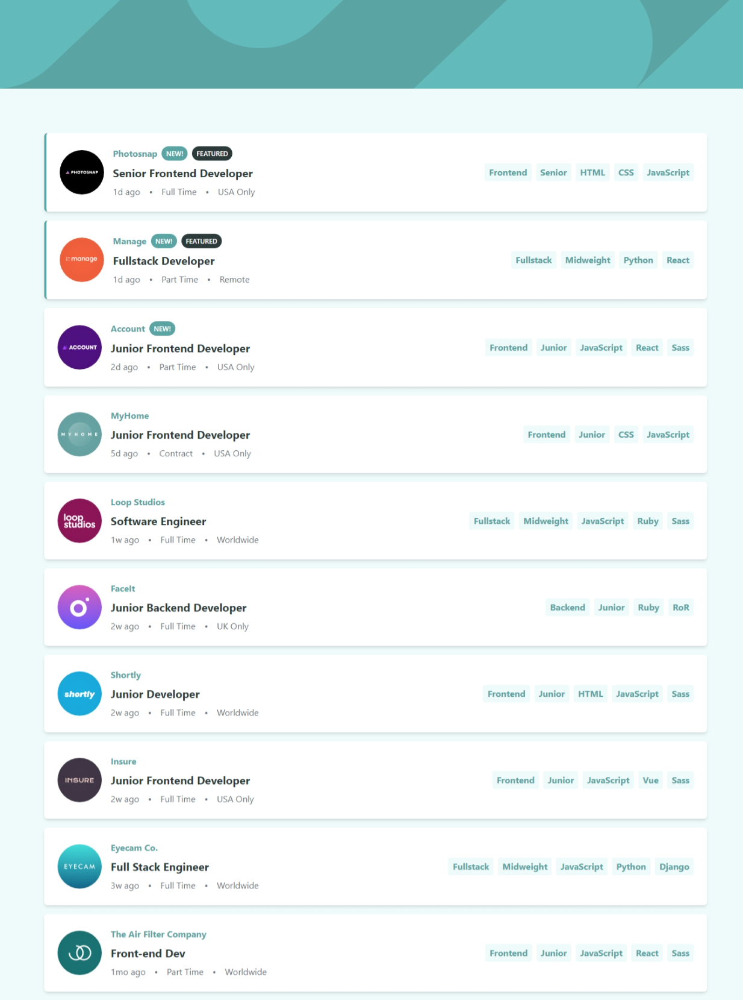

# Frontend Mentor - Job listings with filtering solution

This is a solution to the [Job listings with filtering challenge on Frontend Mentor](https://www.frontendmentor.io/challenges/job-listings-with-filtering-ivstIPCt). Frontend Mentor challenges help you improve your coding skills by building realistic projects.

## Table of contents

- [Overview](#overview)
  - [The challenge](#the-challenge)
  - [Screenshot](#screenshot)
  - [Links](#links)
- [My process](#my-process)
  - [Built with](#built-with)
  - [What I learned](#what-i-learned)
  - [Continued development](#continued-development)
  - [Useful resources](#useful-resources)
- [Author](#author)
- [Acknowledgments](#acknowledgments)

## Overview

### The challenge

Users should be able to:

- View the optimal layout for the site depending on their device's screen size
- See hover states for all interactive elements on the page
- Filter job listings based on the categories

### Screenshot

### Links

- Solution URL: [Add solution URL here](https://your-solution-url.com)
- Live Site URL: [Add live site URL here](https://your-live-site-url.com)

## My process

### Built with

- Semantic HTML5 markup
- Mobile-first workflow
- [React](https://reactjs.org/) - JS library
- [TailwindCSS](https://tailwindcss.com) - css Framework
- [Framer Motion](https://framer.dev) - Animation library

### What I learned

 - Creating dynamic filtering functionality for multiple categories
 - Managing filter state and updates
 - Implementing tag-based filtering system

## Author

- Website - [Mahmood Hashemi](https://main--mahmood-hashemi.netlify.app/)
- Frontend Mentor - [@MahmoodHashemi](https://www.frontendmentor.io/profile/MahmoodHashemi)
- Twitter - [@Mahmood18999963](https://twitter.com/Mahmood18999963)
- LinkedIn - [Shah Mahmood Hashemi](https://www.linkedin.com/in/shah-mahmood-hashemi-55172a276/)

## Acknowledgments

Special thanks to Frontend Mentor for providing this challenging project that helped enhance my React and modern web development skills.

