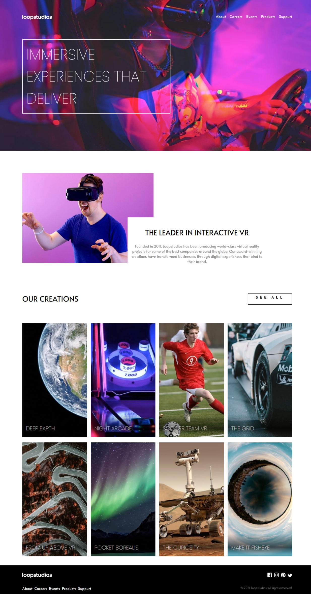

# Frontend Mentor - Loopstudios landing page solution

This is a solution to the [Loopstudios landing page challenge on Frontend Mentor](https://www.frontendmentor.io/challenges/loopstudios-landing-page-N88J5Onjw). Frontend Mentor challenges help you improve your coding skills by building realistic projects.

## Table of contents

- [Overview](#overview)
  - [The challenge](#the-challenge)
  - [Screenshot](#screenshot)
  - [Links](#links)
- [My process](#my-process)
  - [Built with](#built-with)
  - [What I learned](#what-i-learned)
- [Author](#author)
- [Acknowledgments](#acknowledgments)

## Overview

### The challenge

Users should be able to:

- View the optimal layout for the site depending on their device's screen size
- See hover states for all interactive elements on the page

### Screenshot

### Links

- [Solution URL](https://github.com/MahmoodHashem/Mentor-Challanges/tree/main/loopstudio-landing-page)
- [Live Site URL](https://mahmoodhashem.github.io/Mentor-Challanges/loopstudio-landing-page/index.html)

## My process

### Built with

- Semantic HTML5 markup
- CSS custom properties
- Flexbox
- CSS Grid
- Mobile-first workflow

### What I learned

Using `picture` element to create responsive images in html also `scroll()` and `view()` functions of `animation-timeline`

## Author

- [My Portfolio](https://your-portfolio-url.com)
- [Frontend Mentor Profile](https://www.frontendmentor.io/profile/yourusername)
- [Twitter](https://twitter.com/yourusername)
- [LinkedIn](https://www.linkedin.com/in/yourusername)

## Acknowledgments

I would like to extend my gratitude to the Frontend Mentor  for their resources they provide. A special thanks to all the content creators and developers whose tutorials and articles have helped me improve my skills.
