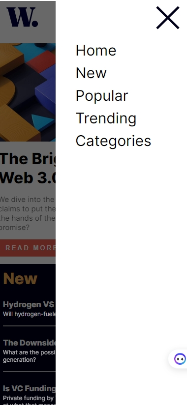

# Frontend Mentor - News homepage solution

This is a solution to the [News homepage challenge on Frontend Mentor](https://www.frontendmentor.io/challenges/news-homepage-H6SWTa1MFl). Frontend Mentor challenges help you improve your coding skills by building realistic projects. 

## Table of contents

- [Overview](#overview)
  - [The challenge](#the-challenge)
  - [Screenshot](#screenshot)
  - [Links](#links)
- [My process](#my-process)
  - [Built with](#built-with)
  - [What I learned](#what-i-learned)
  - [Useful resources](#useful-resources)
- [Author](#author)
- [Acknowledgments](#acknowledgments)

## Overview

### The challenge

Users should be able to:

- View the optimal layout for the interface depending on their device's screen size
- See hover and focus states for all interactive elements on the page

### Screenshot

### Links

- [Solution Repository](https://github.com/MahmoodHashem/Mentor-Challanges/tree/main/news-homepage-main)
- [Live Site URL](https://mahmoodhashem.github.io/Mentor-Challanges/Blog%20card/index.html)

## My process

### Built with

- Semantic HTML5 markup
- CSS custom properties
- Flexbox
- CSS Grid
- Mobile-first workflow
- JavaScript

### What I learned

This challenge was particularly difficult as it required me to advance my knowledge of CSS Grid, which I managed to learn more about during the process.

### Useful resources

- [Play Grid Attack](https://codingfantasy.com/games/css-grid-attack/play?mode=easy&love=true) - This Game helped me a lot  for learning grid from basic reason. I really liked that, and suggest to everyone who want to learn Grid. 

## Author

- Website - [Mahmood Hashemi](https://t.me/shahmahmood)
- Frontend Mentor - [@MahmoodHashem](https://www.frontendmentor.io/profile/MahmoodHasheme/yourusername)
- Twitter - [@Mahmood18999963](https://twitter.com/Mahmood18999963)

## Acknowledgments

I would like to express my gratitude to all content creators, bloggers, and senior developers who have generously made learning web development accessible and free for us. 
