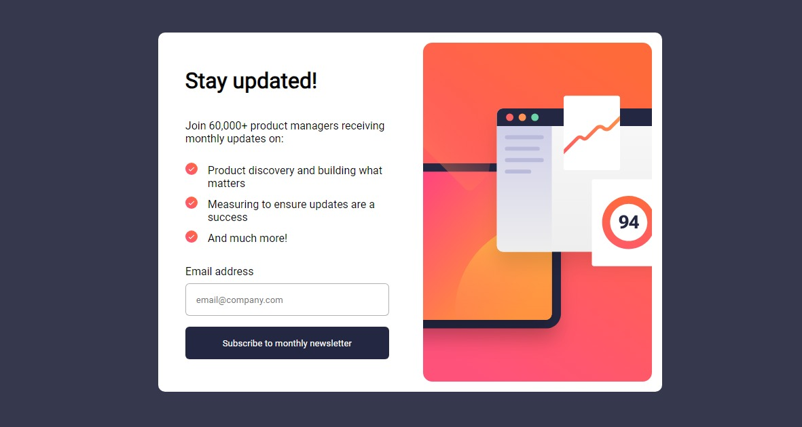

# Frontend Mentor - Newsletter sign-up form with success message solution

This is a solution to the [Newsletter sign-up form with success message challenge on Frontend Mentor](https://www.frontendmentor.io/challenges/newsletter-signup-form-with-success-message-3FC1AZbNrv). Frontend Mentor challenges help you improve your coding skills by building realistic projects. 

## Table of contents

- [Overview](#overview)
  - [The challenge](#the-challenge)
  - [Screenshot](#screenshot)
  - [Links](#links)
- [My process](#my-process)
  - [Built with](#built-with)
  - [What I learned](#what-i-learned)
  - [Continued development](#continued-development)
  - [Useful resources](#useful-resources)
- [Author](#author)
- [Acknowledgments](#acknowledgments)

## Overview

### The challenge

Users should be able to:

- Add their email and submit the form
- See a success message with their email after successfully submitting the form
- See form validation messages if:
  - The field is left empty
  - The email address is not formatted correctly
- View the optimal layout for the interface depending on their device's screen size
- See hover and focus states for all interactive elements on the page

### Screenshot

### Links

- [Solution Repo](https://github.com/MahmoodHashem/Mentor-Challanges/tree/main/newsletter-sign-up-with-success-message-main/newsletter-sign-up-with-success-message-main)
- [Live Site](https://mahmoodhashem.github.io/Mentor-Challanges/newsletter-sign-up-with-success-message-main/newsletter-sign-up-with-success-message-main/index.html)

## My process

### Built with

- Semantic HTML5 markup
- CSS custom properties
- Flexbox
- JavaScript
- Mobile-first workflow

### What I learned

Through this project, I gained substantial experience in DOM manipulation, which involved dynamically altering the HTML and CSS using JavaScript. I learned how to effectively add, remove, and modify attributes within HTML elements, which enabled me to create a more interactive and responsive user interface. Additionally, this project was an excellent opportunity to deepen my understanding of JavaScript event handling and how it integrates with the web page's lifecycle. The hands-on experience was incredibly rewarding and has significantly enhanced my skills in web development. This project was not only educational but also a highly enjoyable experience that has increased my enthusiasm for future projects in this field.

### Useful resources

- [StackOverflow](https://stackoverflow.com/) - This helped me for Errors and some stuck that i had. I really liked this website and will use it going forward.
- [W3School](https://www.w3schools.com/) - This is an amazing learning platform which helped me learn javascript and css more deeply. I'd recommend it to anyone still learning this concept.

## Author

- Website - [Mahmood Hashemi](https://t.me/shahmahmood)
- Frontend Mentor - [@MahmoodHashem](https://www.frontendmentor.io/profile/MahmoodHasheme/yourusername)
- Twitter - [@Mahmood18999963](https://twitter.com/Mahmood18999963)

