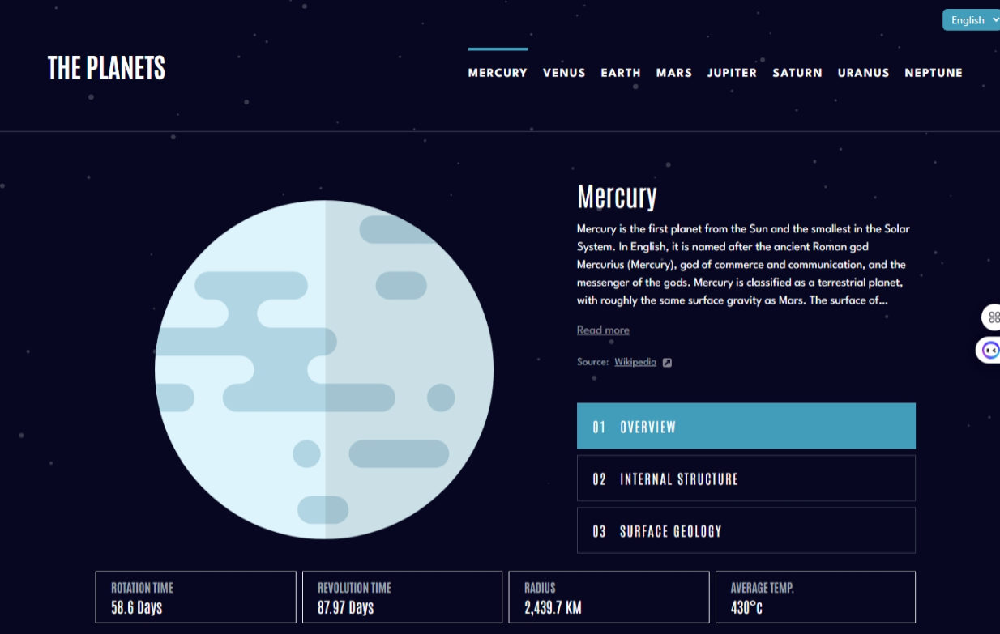
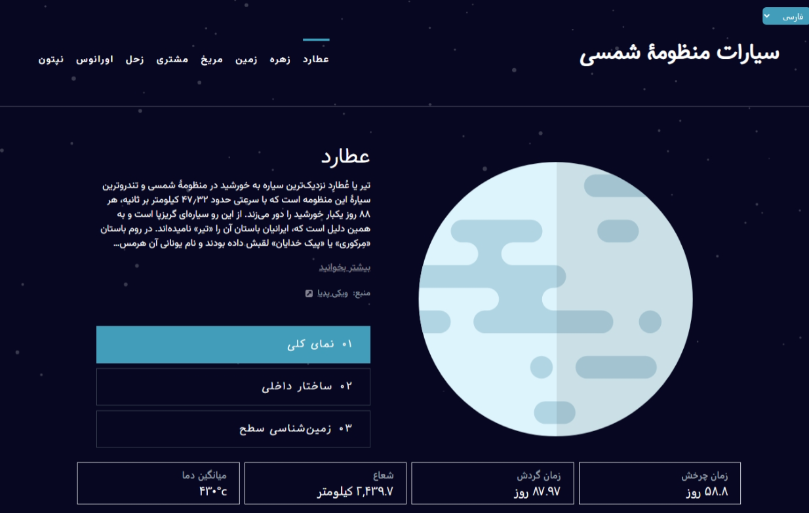

# Planets Fact Site

This is my solution to the [Planets Fact site challenge on Frontend Mentor](). Frontend Mentor challenges help you improve your coding skills by building realistic projects.

## The Challenge

Your users should be able to:

* View each planet page and toggle between the "Overview", "Internal Structure", and "Surface Geology" tabs
* View the optimal layout for the app depending on their device's screen size

## Screenshot

## Table of Contents

- [Features](#features)
- [Link](#link)
- [Technologies Used](#technologies-used)
- [What I Learned](#what-i-learned)

## Features

## Link

* [Live Site](https://space-tourism-ten-wine.vercel.app/)
* [Solution URL](https://github.com/MahmoodHashem/Mentor-Challanges/tree/main/space-tourism-website)

## Technologies Used

* ReactJS
* Tailwind CSS
* Motion
* React Router

## What I Learned

* **Internationalization (i18n)** :

  * The application uses the `react-i18next` library for managing translations. This allows the app to support multiple languages (English and Persian in this case).
  * The `useTranslation` hook is employed to retrieve translation functions (`t`) and manage the current language (`i18n.language`).
* **Dynamic Content** :

  * The planet data is structured in an object and converted into an array of entries for easier mapping and rendering. The content displayed in the UI changes based on the selected planet and active tab.
  * This dynamic rendering allows for a responsive and interactive experience, where users can click on different planets and view their respective details.
* **Content Expansion** :

  * The component implements a "Read more" functionality, allowing users to expand or collapse additional information about the selected planet. This enhances usability by keeping the interface clean while providing more information when desired.

## Continues Development

* **Performance Optimization** : I will Consider using `React.memo` or similar techniques to optimize rendering, especially if the component becomes more complex.
* **Unit Testing** : I will Add unit tests to verify the functionality of components, especially for language toggling and dynamic content rendering.

## Author

- [My Portfolio](https://main--mahmood-hashemi.netlify.app/)
- [Fronted Mentor](https://www.frontendmentor.io/profile/MahmoodHasheme/yourusername)
- [Twitter](https://twitter.com/Mahmood18999963)
- [LinkedIn](https://www.linkedin.com/in/shah-mahmood-hashemi-55172a276/)

## Acknowledgments

I would like to express my gratitude to all content creators, bloggers, and senior developers who have generously made learning web development accessible and free for us.
