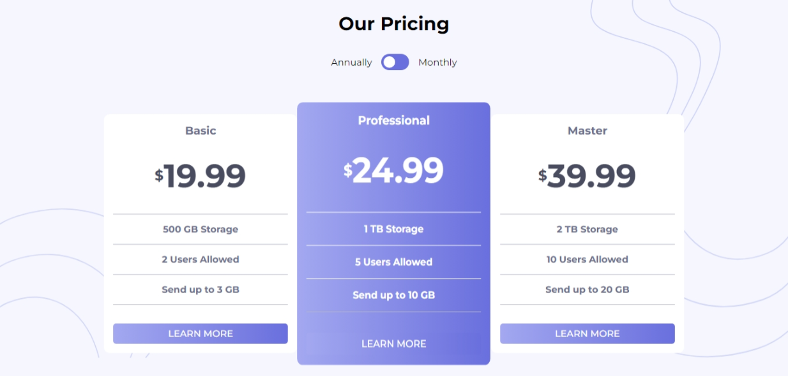

# Frontend Mentor - Pricing component with toggle solution

This is a solution to the [Pricing component with toggle challenge on Frontend Mentor](https://www.frontendmentor.io/challenges/pricing-component-with-toggle-8vPwRMIC). Frontend Mentor challenges help you improve your coding skills by building realistic projects.

## Table of contents

- [Overview](#overview)
  - [The challenge](#the-challenge)
  - [Screenshot](#screenshot)
  - [Links](#links)
- [My process](#my-process)
  - [Built with](#built-with)
  - [What I learned](#what-i-learned)
- [Author](#author)
- [Acknowledgments](#acknowledgments)

## Overview

### The challenge

Users should be able to:

- View the optimal layout for the component depending on their device's screen size
- Control the toggle with both their mouse/trackpad and their keyboard
- **Bonus**: Complete the challenge with just HTML and CSS

### Screenshot



### Links

- [Solution URL](https://github.com/MahmoodHashem/Mentor-Challanges/tree/main/pricing-component-with-toggle)
- [Live Site URL](https://mahmoodhashem.github.io/Mentor-Challanges/pricing-component-with-toggle/index.html)

## My process

### Built with

- Semantic HTML5 markup
- CSS custom properties
- Flexbox
- CSS Grid
- Mobile-first workflow

### What I learned

I could change the prices dynamicly without using Javascirpt.

```css

.card .basic::after{
    content: '19.99';
}

.card .professional::after{
    content: '24.99';
}


.card .master::after{
    content: '39.99' ;
}


main:has(.toggle-input:checked) .card .basic::after {
    content: '199.99'
}

main:has(.toggle-input:checked) .card .professional::after{
    content: '249.99';
}

main:has(.toggle-input:checked) .card .master::after{
    content: '399.99';
}

```


## Author

- [My Portfolio](https://your-portfolio-url.com)
- [Frontend Mentor Profile](https://www.frontendmentor.io/profile/yourusername)
- [Twitter](https://twitter.com/yourusername)
- [LinkedIn](https://www.linkedin.com/in/yourusername)

## Acknowledgments

I would like to extend my gratitude to the Frontend Mentor  for their resources they provide. A special thanks to all the content creators and developers whose tutorials and articles have helped me improve my skills.
