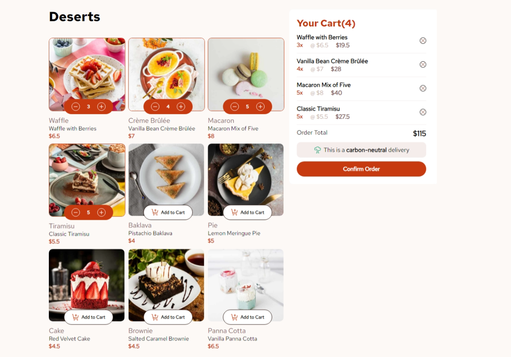

# Product List with Cart

This is a solution to the [Product list with cart challenge on Frontend Mentor](https://www.frontendmentor.io/challenges/product-list-with-cart-5MmqLVAp_d). Frontend Mentor challenges help you improve your coding skills by building realistic projects.

### The challenge

Users should be able to:

- Add items to the cart and remove them
- Increase/decrease the number of items in the cart
- See an order confirmation modal when they click "Confirm Order"
- Reset their selections when they click "Start New Order"
- View the optimal layout for the interface depending on their device's screen size
- See hover and focus states for all interactive elements on the page

## Screenshot

## Table of Contents

- [Features](#features)
- [Link](#link)
- [Technologies Used](#technologies-used)
- [What I Learned](#what-i-learned)

## Features

- **Product Browsing**: Users can view a list of desserts with images, names, categories, and prices.
- **Add to Cart**: Users can add desserts to their shopping cart with a simple click.
- **Cart Management**: Users can increment or decrement the quantity of items in the cart, remove items, and view the total price.
- **Keyboard Navigation**: Users can adjust the quantity of products using the up and down arrow keys when focused on the quantity buttons, enhancing accessibility.
- **Order Confirmation**: A modal displays when the user confirms their order, summarizing the purchased items and total cost.
- **Responsive Design**: The app adapts to different screen sizes, providing a seamless experience on both desktop and mobile devices.

## Link

* [Live sit](https://product-list-dun.vercel.app/)e
* [Solution URL](https://github.com/MahmoodHashem/Mentor-Challanges/tree/main/product-list-with-cart)

## Technologies Used

- **React**: For building the user interface and managing application state.
- **CSS**: For styling the application and ensuring a responsive layout.
- **JavaScript (ES6+)**: For implementing the app’s logic and functionality.
- **HTML**: For structuring the content of the app, including the modal and product listings.

## What I Learned

- Best practices for component composition, creating reusable components for products, cart, and modals.
- Implementing event handling to manage user actions such as adding to the cart, removing items, and confirming orders.
- Enhancing accessibility by allowing keyboard navigation for quantity adjustments using the up and down arrow keys.
- Working with the `<dialog>` element for creating modals, enhancing accessibility and user experience.
- Performing calculations based on cart contents, such as total price and quantities, to provide users with accurate order summaries.
- Utilizing the `useRef` hook to manage focus and event listeners for improved accessibility.

## Author

- [My Portfolio](https://main--mahmood-hashemi.netlify.app/)
- [Fronted Mentor](https://www.frontendmentor.io/profile/MahmoodHasheme/yourusername)
- [Twitter](https://twitter.com/Mahmood18999963)
- [LinkedIn](https://www.linkedin.com/in/shah-mahmood-hashemi-55172a276/)

## Acknowledgments

I would like to express my gratitude to all content creators, bloggers, and senior developers who have generously made learning web development accessible and free for us.
