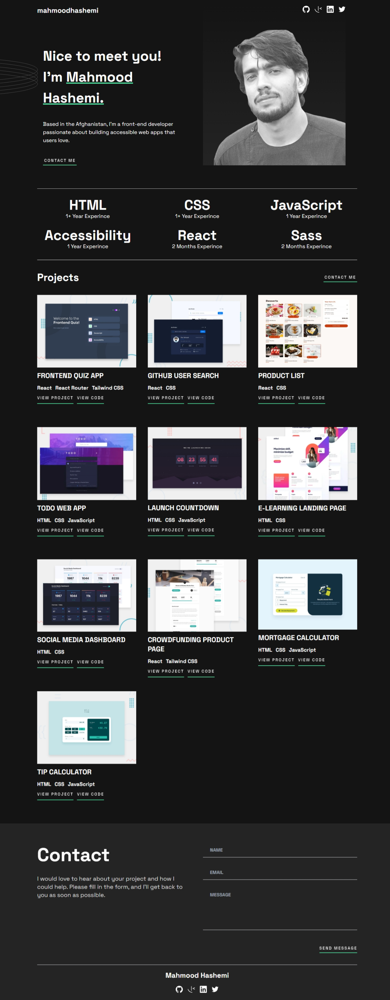

# Single Page - Developer Portfolio

This is a solution to the [Single-page developer portfolio challenge on Frontend Mentor](https://www.frontendmentor.io/challenges/singlepage-developer-portfolio-bBVj2ZPi-x). Frontend Mentor challenges help you improve your coding skills by building realistic projects.

## The Challenge

Users should be able to:

* Receive an error message when the `form` is submitted if:
  * Any field is empty
  * The email address is not formatted correctly
* View the optimal layout for the interface depending on their device's screen size
* See hover and focus states for all interactive elements on the page
* **Bonus**: Hook the form up so it sends and stores the user's inquiry (you can use a spreadsheet or Airtable to save the inquiries)
* **Bonus**: Add your own details (image, skills, projects) to replace the ones in the design

## Screenshot

## Table of Contents

- [Features](#features)
- [Link](#link)
- [Technologies Used](#technologies-used)
- [What I Learned](#what-i-learned)

## Features

- **Responsive Design**: The layout adapts seamlessly across devices using Tailwind CSS, ensuring an optimal viewing experience on mobile, tablet, and desktop screens.
- **Smooth Scroll Animations**: Integrated AOS (Animate On Scroll) library for engaging scroll-based animations that enhance user interaction.
- **Dynamic Project Display**: Showcases a selection of projects with images, descriptions, and links to both live demos and source code.
- **Email Contact Form**: Users can easily reach out through a contact form, with validations for required fields and email format.

## Link

* [Live Site](https://developer-portfolio-phi-teal.vercel.app/)  
* [Solution URL](https://github.com/MahmoodHashem/Mentor-Challanges/tree/main/single-page-developer-portfolio)

## Technologies Used

- **React**: For building the user interface and managing application state.
- **Tailwind CSS**: For styling the application and ensuring a responsive layout.
- **JavaScript (ES6+)**: For implementing the app’s logic and functionality.
- **[EmailJS](https://www.emailjs.com/)**: For sending emails directly from the contact form.
- **[AOS](https://michalsnik.github.io/aos/)**: For scroll animations to enhance user engagement.
- **React Toastify**: For user-friendly notifications and alerts.

## What I Learned

- Implementing scroll animations to improve user experience.
- Setting up a contact form with EmailJS for handling user inquiries.
- Building a responsive layout with Tailwind CSS.
- Managing state and props in React for dynamic content rendering.

## Author

- [My Portfolio](https://main--mahmood-hashemi.netlify.app/)
- [Fronted Mentor](https://www.frontendmentor.io/profile/MahmoodHasheme/yourusername)
- [Twitter](https://twitter.com/Mahmood18999963)
- [LinkedIn](https://www.linkedin.com/in/shah-mahmood-hashemi-55172a276/)

## Acknowledgments

I would like to express my gratitude to all content creators, bloggers, and senior developers who have generously made learning web development accessible and free for us.
