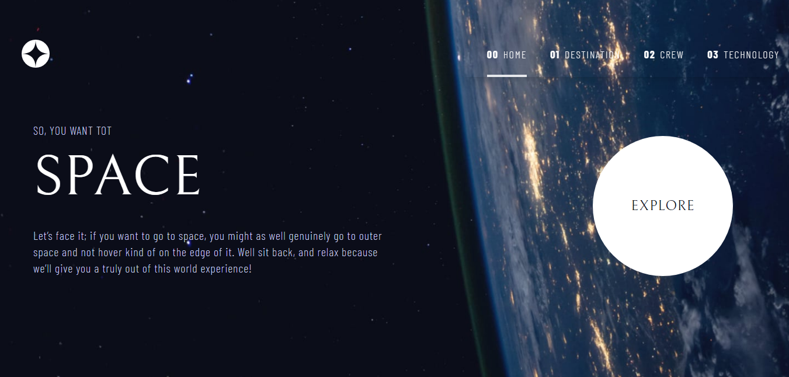

# Space Tourism Website

This is my solution to the [Space tourism website challenge on Frontend Mentor](https://www.frontendmentor.io/challenges/space-tourism-multipage-website-gRWj1URZ3). Frontend Mentor challenges help you improve your coding skills by building realistic projects.

## The Challenge

Users should be able to:

- View the optimal layout for each of the website's pages depending on their device's screen size
- See hover states for all interactive elements on the page
- View each page and be able to toggle between the tabs to see new information

## Screenshot

## Table of Contents

- [Features](#features)
- [Link](#link)
- [Technologies Used](#technologies-used)
- [What I Learned](#what-i-learned)

## Features

## Link

* [Live Site](https://space-tourism-ten-wine.vercel.app/)
* [Solution URL](https://github.com/MahmoodHashem/Mentor-Challanges/tree/main/space-tourism-website)

## Technologies Used

* ReactJS
* Tailwind CSS
* Motion
* React Router

## What I Learned

* **Tab Navigation** :

  * Each planet is represented by a button. When a button is clicked, the corresponding planet's details are displayed, and the active button is visually distinguished using Tailwind CSS classes.
* **Animation with `motion` from Framer Motion** :The `motion` components are used for smooth animations. For example:

  * The tab indicator (the line under the active tab) animates its position using the `layoutId` and `animate` properties.
  * The content associated with each tab fades in and out using `initial`, `animate`, and `exit` properties.

## Author

- [My Portfolio](https://main--mahmood-hashemi.netlify.app/)
- [Fronted Mentor](https://www.frontendmentor.io/profile/MahmoodHasheme/yourusername)
- [Twitter](https://twitter.com/Mahmood18999963)
- [LinkedIn](https://www.linkedin.com/in/shah-mahmood-hashemi-55172a276/)

## Acknowledgments

I would like to express my gratitude to all content creators, bloggers, and senior developers who have generously made learning web development accessible and free for us.
