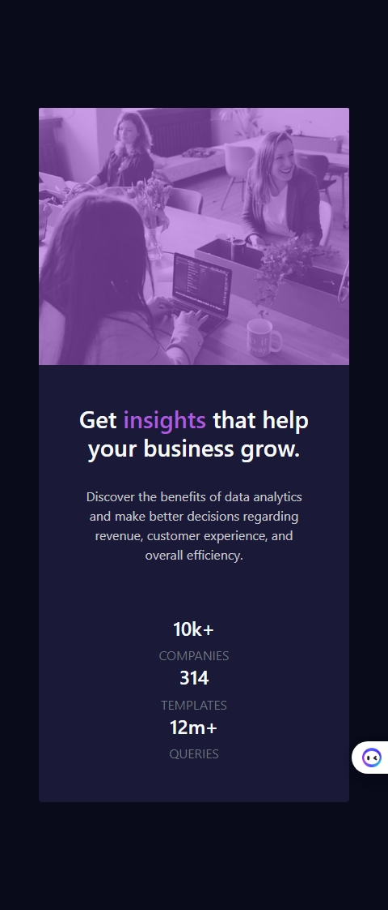

# Frontend Mentor - Stats preview card component solution

This is a solution to the [Stats preview card component challenge on Frontend Mentor](https://www.frontendmentor.io/challenges/stats-preview-card-component-8JqbgoU62). Frontend Mentor challenges help you improve your coding skills by building realistic projects.

## Table of contents

- [Overview](#overview)
  - [The challenge](#the-challenge)
  - [Screenshot](#screenshot)
  - [Links](#links)
- [My process](#my-process)
  - [Built with](#built-with)
  - [What I learned](#what-i-learned)
  - [Continued development](#continued-development)
  - [Useful resources](#useful-resources)
- [Author](#author)
- [Acknowledgments](#acknowledgments)

## Overview

### The challenge

Users should be able to:

- View the optimal layout depending on their device's screen size

### Screenshot

; 

### Links

- [Solution URL](https://github.com/MahmoodHashem/Mentor-Challanges/tree/main/stats-preview-card)
-  [Live site URL](https://mahmoodhashem.github.io/Mentor-Challanges/stats-preview-card/index.html)

## My process

### Built with

- Semantic HTML5 markup
- CSS custom properties
- Flexbox
- CSS Grid
- Mobile-first workflow
- [Bootsrap]() - Css Framework

### What I learned

In this project, I encountered a challenge where I needed to adjust the color of an image. Initially, I thought the CSS filter property could be a solution, so I explored using filters to achieve the desired effect. However, I found that the filter property was not directly applicable to this specific use case, as it didn't allow me to set the exact color I needed for the image.

To overcome this, I instead created a container with the class name "overlay" and set the background color of that container to match the desired project color. This allowed me to achieve the visual effect I was going for, without relying on the filter property.

The second key thing I learned during this project was how to leverage responsive utility classes provided by Bootstrap. Specifically, I used classes like "text-center" to align text, and various flexbox-related classes to create a flexible and responsive layout. These Bootstrap utilities helped me implement a mobile-friendly design without having to write extensive custom CSS.

Overall, this project challenged me to think creatively about CSS techniques and explore different solutions to achieve my design goals. While the filter property didn't end up being the right fit, I'm glad I took the time to understand it better, as that knowledge may prove useful in future projects. And mastering Bootstrap's responsive utilities has been an invaluable skill that I'll continue to build on going forward.

## Author

- [My Portfolio](https://main--mahmood-hashemi.netlify.app/)
- [Fronted Mentor](https://www.frontendmentor.io/profile/MahmoodHasheme/yourusername)
- [Twitter](https://twitter.com/Mahmood18999963)
- [LinkedIn](https://www.linkedin.com/in/shah-mahmood-hashemi-55172a276/)

## Acknowledgments

I would like to express my gratitude to all content creators, bloggers, and senior developers who have generously made learning web development accessible and free for us.
