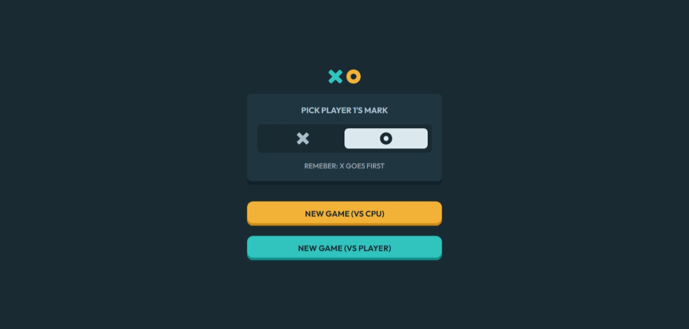
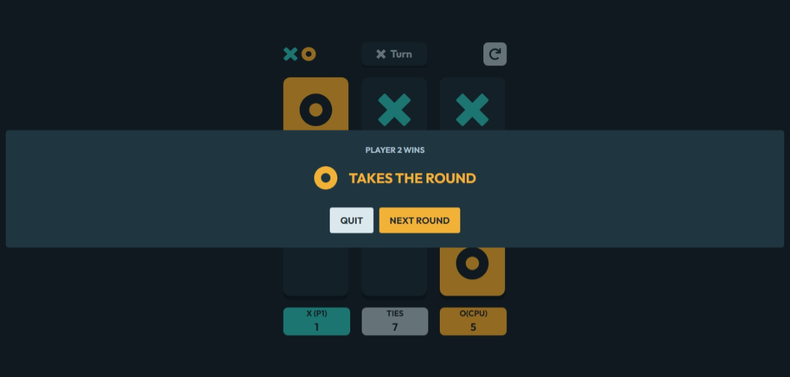
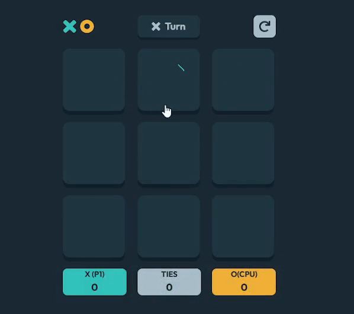

# Tic Tac Toe

This is my solution to the [Tic Tac Toe challenge on Frontend Mentor](https://www.frontendmentor.io/challenges/tic-tac-toe-game-Re7ZF_E2v). Frontend Mentor challenges help you improve your coding skills by building realistic projects.

A responsive Tic Tac Toe game that allows players to compete against each other or against a simple CPU opponent. The game features a clean interface, customizable player types (X or O), and score tracking.

## The Challenge

Your users should be able to:

* View the optimal layout for the game depending on their device's screen size
* See hover states for all interactive elements on the page
* Play the game either solo vs the computer or multiplayer against another person
* **Bonus 1** : Save the game state in the browser so that it’s preserved if the player refreshes their browser
* **Bonus 2** : Instead of having the computer randomly make their moves, try making it clever so it’s proactive in blocking your moves and trying to win

## Screenshot





## Table of Contents

- [Features](#features)
- [Link](#link)
- [Technologies Used](#technologies-used)
- [What I Learned](#what-i-learned)
- [Author](#author)
- [Acknowledgments](#acknowledgments)

## Features

- **Responsive Design**: The game adapts to different screen sizes, providing an optimal experience on both mobile and desktop devices.
- **Player vs. Player or CPU Mode**: Users can choose to play against a friend or a simple AI.
- **Game Logic**: Implements win conditions, and detects ties, providing clear feedback on the game outcome.
- **Score Tracking**: Keeps track of scores for both players and ties, displaying them after each round.
- **Interactive UI**: Utilizes modals for displaying results and notifications, enhancing user engagement.

## Link

* [Live Site](https://tic-tac-toe-rouge-tau.vercel.app/)
* [Solution URL](https://github.com/MahmoodHashem/Mentor-Challanges/tree/main/tic-tac-toe)

## Technologies Used

- **React**: For building the user interface and managing application state.
- **Tailwind CSS**: For styling the application and ensuring a responsive layout.
- **JavaScript (ES6+)**: For implementing the game logic and interactions.
- **SweetAlert2**: For creating beautiful modals and alerts for users.
- **React Vivus**: For creating beautiful modals and alerts for users.


## What I Learned

- Implementing game logic to handle player turns and detect wins/ties.
- Managing state and props in React for dynamic content rendering.
- The Cput AI Logic( It is very smart)

```js
const makeCpuMove = () => {
    const emptyIndices = boxContent.map((value, index) => value === null ? index : null).filter(index => index !== null);
  
    const cpuType = isTypeX ? 'O' : 'X'
    const playerType = isTypeX ? 'X' : 'O'

    // Check if CPU can win in the next move
    for (let i = 0; i < emptyIndices.length; i++) {
      const index = emptyIndices[i];
      const newContent = [...boxContent];
      newContent[index] = cpuType; // Assume CPU is 'O'
      if (winner(newContent)?.winner === cpuType) {
        handleBoxClick(index);
        return;
      }
    }
  
    // Check if player can win in the next move and block it
    for (let i = 0; i < emptyIndices.length; i++) {
      const index = emptyIndices[i];
      const newContent = [...boxContent];
      newContent[index] = playerType; // Assume player is 'X'
      if (winner(newContent)?.winner === playerType) {
        handleMouseEnter(index)
        handleBoxClick(index);
        return;
      }
    }
  
    // Otherwise, choose a random move
    if (emptyIndices.length > 0) {
      const randomIndex = emptyIndices[Math.floor(Math.random() * emptyIndices.length)];
      handleBoxClick(randomIndex);
    }
  };
```

## Author

- [My Portfolio](https://main--mahmood-hashemi.netlify.app/)
- [Frontend Mentor](https://www.frontendmentor.io/profile/MahmoodHasheme/yourusername)
- [Twitter](https://twitter.com/Mahmood18999963)
- [LinkedIn](https://www.linkedin.com/in/shah-mahmood-hashemi-55172a276/)

## Acknowledgments

I would like to express my gratitude to all content creators, bloggers, and senior developers who have generously made learning web development accessible and free for us.
