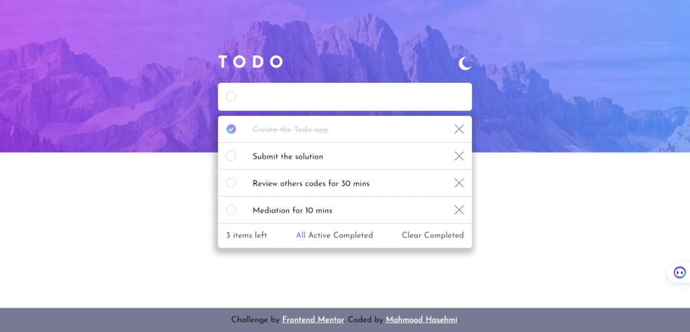

# Frontend Mentor - Todo app solution

This is my solution to the [Todo app challenge on Frontend Mentor](https://www.frontendmentor.io/challenges/todo-app-Su1_KokOW). Frontend Mentor challenges help you improve your coding skills by building realistic projects.

## Table of contents

- [Overview](#overview)
  - [The challenge](#the-challenge)
  - [Screenshot](#screenshot)
  - [Links](#links)
- [My process](#my-process)
  - [Built with](#built-with)
  - [What I learned](#what-i-learned)
  - [Continued development](#continued-development)
  - [Useful resources](#useful-resources)
- [Author](#author)
- [Acknowledgments](#acknowledgments)**.**

## Overview

### The challenge

Users should be able to:

- View the optimal layout for the app depending on their device's screen size
- See hover states for all interactive elements on the page
- Add new todos to the list
- Mark todos as complete
- Delete todos from the list
- Filter by all/active/complete todos
- Clear all completed todos
- Toggle light and dark mode
- **Bonus**: Drag and drop to reorder items on the list

### Screenshot

### Links

- [Solution URL](https://github.com/MahmoodHashem/Mentor-Challanges/tree/main/todo-app)
- [Live Site URL](https://mahmoodhashem.github.io/Mentor-Challanges/todo-app/index.html)

## My process

### Built with

- Semantic HTML5 markup
- CSS custom properties
- Flexbox
- CSS Grid
- Mobile-first workflow
- Vanila Javascript

### What I learned

1. Browser Local Storage Manipulation:

   - One of the core things I learned was how to effectively use the browser's local storage to persist user data.
   - This allowed me to store task-related information, such as the todo items and their completion statuses, even after the page was refreshed or the browser was closed.
   - Mastering the `localStorage.setItem()`, `localStorage.getItem()`, and `localStorage.removeItem()` methods was crucial for ensuring the todo list maintained its state between user sessions.
2. Drag-and-Drop Functionality:

   - Another key learning experience was implementing a drag-and-drop mechanism for reordering the todo list items.
   - I explored techniques to detect and handle the various drag and drop events, such as `dragstart`, `dragover`, `drop`, and `dragend`.
   - This enabled users to easily reorganize the todo items by simply clicking, dragging, and dropping them into their desired order.
3. DOM Manipulation and Event Handling:

   - A significant part of the challenge involved learning how to effectively manipulate the DOM (Document Object Model) and handle various JavaScript events.
   - For example, I learned how to efficiently target and update specific elements within a container, based on their state (e.g., completed or incomplete tasks).
   - This involved techniques like querying the DOM, attaching event listeners, and dynamically updating the UI to reflect the changes.
4. Filtering and Searching Functionality:

   - Another important aspect I mastered was the ability to filter and search the todo list items based on their completion status.
   - I learned how to implement features that allowed users to view all tasks, only completed tasks, or only incomplete tasks.
   - This required understanding how to effectively process and display the todo list data based on the user's selected filter criteria.
5. Individual Task Deletion:

   - The final key learning point was the implementation of individual task deletion functionality.
   - I explored ways to enable users toremove specific todo items from the list, updating the local storage and the UI accordingly.
   - This involved handling click events ondelete buttons and updating the underlying data structure to reflect the changes.

### Continued development

 Enhancing the User Experience:

- Now that I've established the core functionality of the todo list, I'm interested in finding ways to enhance the user experience.
- This could involve adding smooth animations, implementing keyboard shortcuts, or exploring more intuitive drag-and-drop interactions.
- By focusing on polishing the UI and improving the overall usability, I can create a more engaging and delightful experience for the users.

7. Integrating with Backend Systems:

   - While the current implementation relies on browser local storage, I'm curious about incorporating a backend system to store and manage the todo list data.
   - This could involve integrating with a server-side API, allowing users to access their todo lists across devices and enabling collaboration features.
   - Exploring backend integration would expand my skill setin areas like client-server communication, API design, and database management.

### Useful resources

- 🎥 [Web Dev Simplified Video](https://www.youtube.com/watch?v=W7FaYfuwu70) This video was instrumental in helping me grasp the main structure of a Todo app! 📝
- 🎬 [Kevin Powell Video](https://www.youtube.com/watch?v=IhmSidOJSeE&t=0s) A fantastic resource for customizing the checkbox and enhancing the form section. Perfect for elevating your project

## Author

- [My Portfolio](https://main--mahmood-hashemi.netlify.app/)
- [Fronted Mentor](https://www.frontendmentor.io/profile/MahmoodHasheme/yourusername)
- [Twitter](https://twitter.com/Mahmood18999963)
- [LinkedIn](https://www.linkedin.com/in/shah-mahmood-hashemi-55172a276/)

## Acknowledgments

I would like to express my gratitude to all content creators, bloggers, and senior developers who have generously made learning web development accessible and free for us.
