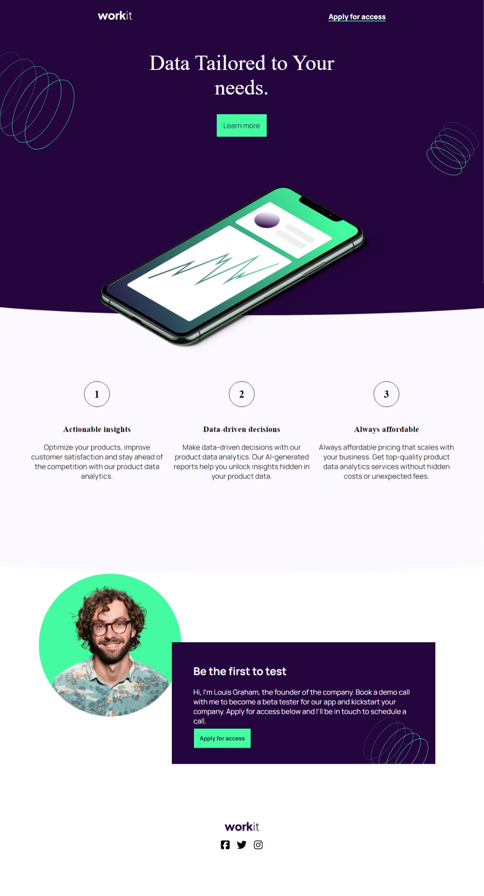
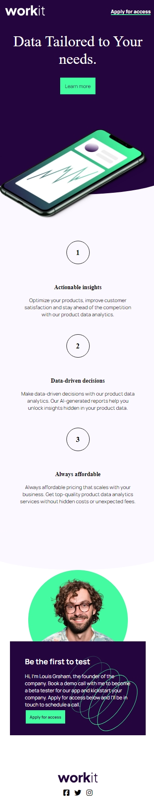

# Frontend Mentor - Workit landing page solution

This is my solution to  [Workit landing page challenge on Frontend Mentor](https://www.frontendmentor.io/challenges/workit-landing-page-2fYnyle5lu).

## Table of contents

- [Overview](#overview)
  - [The challenge](#the-challenge)
  - [Screenshot](#screenshot)
  - [Links](#links)
- [My process](#my-process)
  - [Built with](#built-with)
  - [What I learned](#what-i-learned)
  - [Continued development](#continued-development)
  - [Useful resources](#useful-resources)
- [Author](#author)

## Overview

### The challenge

Users should be able to:

- View the optimal layout for the interface depending on their device's screen size
- See hover and focus states for all interactive elements on the page

### Screenshot

### Links

- [Solution URL](https://github.com/MahmoodHashem/Mentor-Challanges/tree/main/workit-landing-page)
- [Live Site URL](https://mahmoodhashem.github.io/Mentor-Challanges/workit-landing-page/index.html)

## My process

### Built with

- Semantic HTML5 markup
- CSS custom properties
- Flexbox

### What I learned

I discovered clip path

### Continued development

I need to be more cautious with my time estimates! I thought I could finish this in an hour, but it ended up taking nearly four—mostly due to the curved sections and the layout for the founder section. Lesson learned!

### Useful resources

- [MDN](https://developer.mozilla.org/en-US/docs/Web/CSS/clip-path) - Creating an ellipse shape that was layered under another div is how I implemented the curves.

## Author

- [My Portfolio](https://main--mahmood-hashemi.netlify.app/)
- [Fronted Mentor](https://www.frontendmentor.io/profile/MahmoodHasheme/yourusername)
- [Twitter](https://twitter.com/Mahmood18999963)
- [LinkedIn](https://www.linkedin.com/in/shah-mahmood-hashemi-55172a276/)
